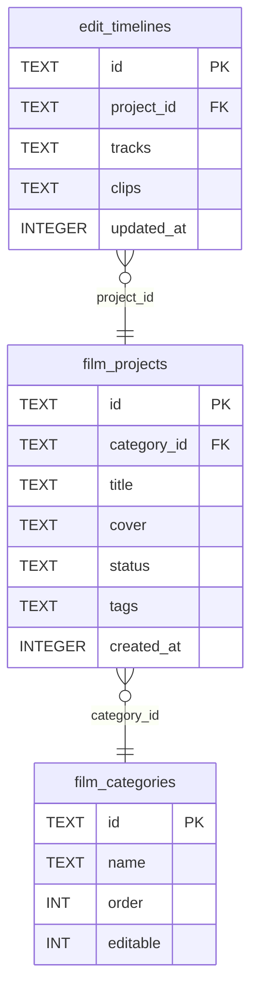
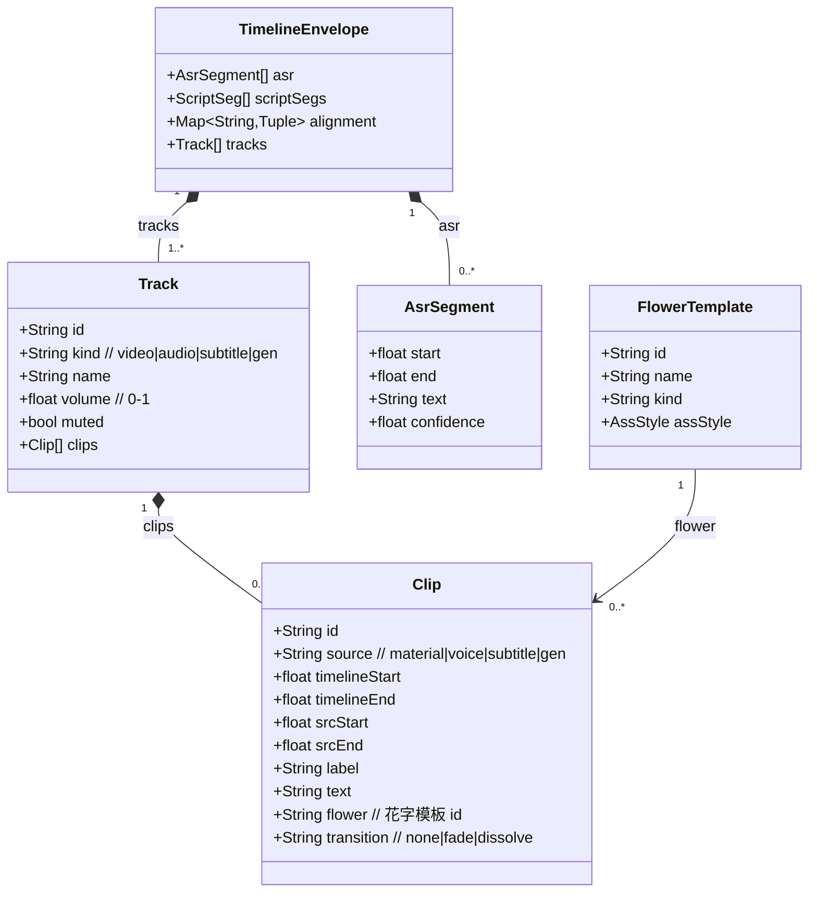
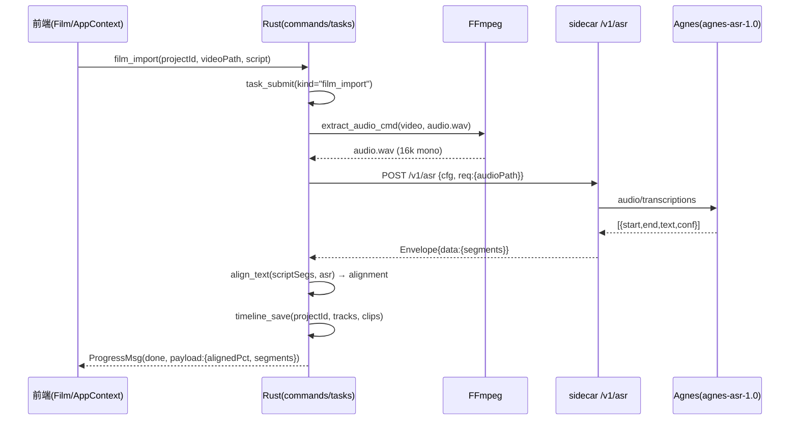
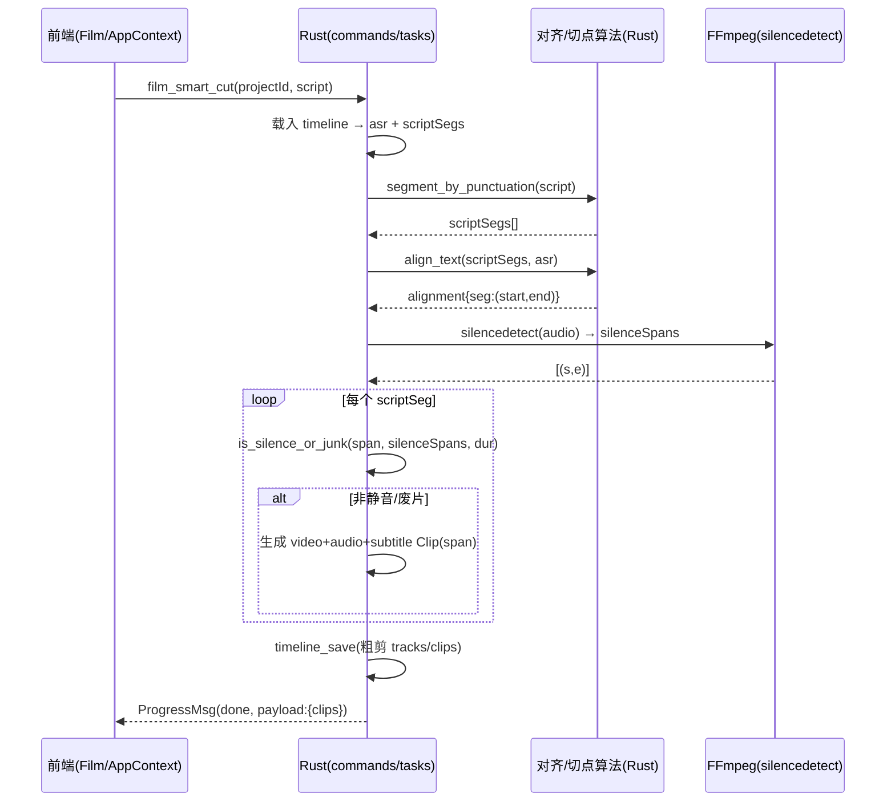
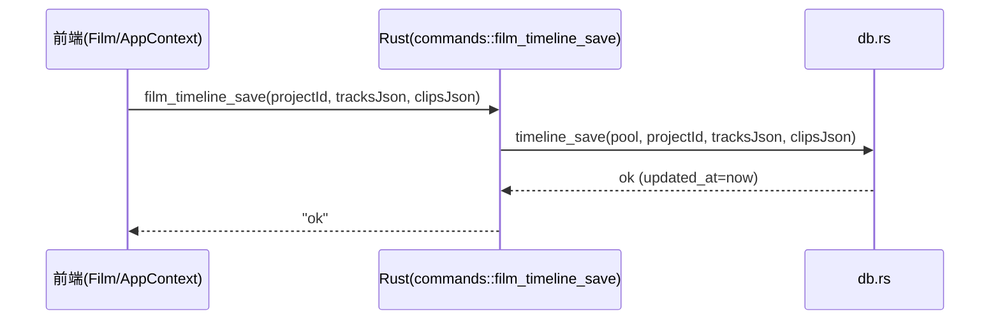
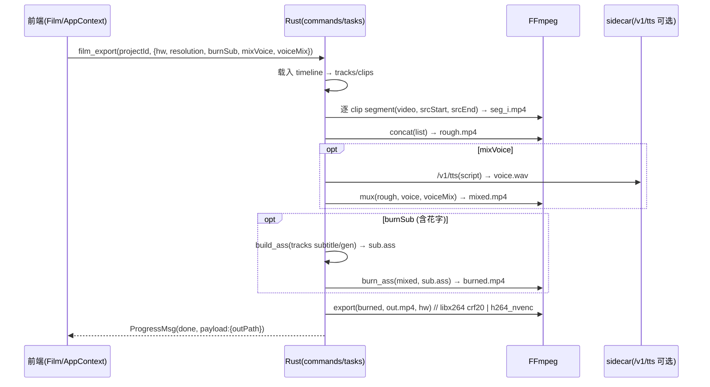
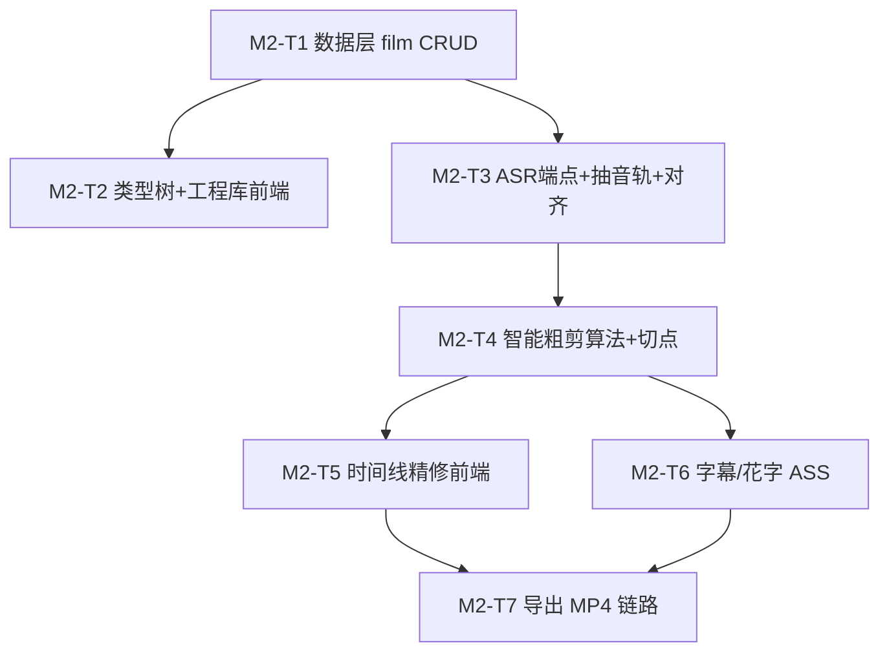

# M2 影片模块 · 系统架构设计与任务分解

> 架构师：高见远（software-architect）｜主理人：齐活林（Qi）
> 配套基线：`docs/dev-plan.md` §M2 / `docs/technical-solution.md` §3.1·§6.0·§7·§8
> 范围：类型树持久化 / 工程库持久化 / 导入抽音轨+ASR 对齐 / 基于文案智能剪辑 / 时间线精修 / 字幕花字烧录 / 导出 MP4

---

## 1. 实现方案 + 框架选型（沿用既有栈，说明 M2 新增点）

### 1.1 技术栈（沿用，不引入新框架）
| 层 | 技术 | 说明 |
|----|------|------|
| 桌面外壳 | Tauri 2 + Rust 1.78+ | 沿用 `src-tauri`，新增 film 命令/任务 |
| 前端 | React 18 + Vite + TS | 沿用 `AppContext` 单一 store（非 Zustand） |
| UI | Editorial Design System v3.0（自研 global.css + Lucide `src/components/icons.tsx`） | **不引入 AntD**，剪辑台 UI 已存在，M2 主要接真实逻辑 |
| 持久层 | sqlx + SQLite（单文件工程库） | 12 表已建，`film_*` 三表补 CRUD |
| 编排/异步 | tokio + reqwest + Tauri Channel | 任务队列 `tasks.rs` 已落地，新增 `film_*` 任务类型 |
| 媒体 | FFmpeg 7.x（首启下载，不随包） | `ffmpeg.rs` 增抽音轨已具备、补静音检测/精确切/concat/导出编排 |
| AI 引擎 | Python sidecar（FastAPI + httpx） | **M2 新增 `/v1/asr` 端点**（关键缺口） |
| ASR 网关 | Agnes `agnes-asr-1.0`（种子已占位） | 依赖外部可达性，见 §8 待确认 |
| 密钥 | keyring（系统凭据库） | 绝不落 SQLite 明文，沿用 `cred.rs` |

### 1.2 M2 相对 M0/M1 的新增点
1. **Rust 数据层**：`db.rs` 补 `film_categories` / `film_projects` / `edit_timelines` 三组 CRUD（现有仅 provider/task）。
2. **Rust 命令层**：`commands.rs` 新增 `film_category_*` / `film_project_*` / `film_timeline_save` / `film_import` / `film_smart_cut` / `film_export`，并在 `lib.rs` 注册。
3. **Rust 任务层**：`tasks.rs` 的 `run_job` 新增 `film_import` / `film_smart_cut` / `film_export` 三分支（复用 `ProgressMsg` 通道）。
4. **FFmpeg 编排**：`ffmpeg.rs` 补 `silence_cmd`（静音检测）、`segment_cmd`（精确切点 `-ss/-to`）、`concat_cmd` 复用、`build_ass`（由花字模板生成 ASS）、`export_cmd` 已具备（软/硬编码）。
5. **Python ASR 端点**：`routers/providers.py` 增 `/v1/asr`；`gateways/agnes.py` 增 `asr()`（whisper 兼容 `/audio/transcriptions` 风格）；`models.py` 增 `AsrRequest`。
6. **前端接线**：`Film.tsx` 6 步 UI 从 `sim()` 假数据改为调 `ipc` 真实命令；`AppContext.tsx` 状态对齐 DB 真实结构；`ipc/client.ts` mock 同步新增命令与任务类型（保证纯 `npm run dev` 不崩）。
7. **花字模板**：固化 6 套 ASS 样式（`mock.ts` 的 `flowerTpls` 扩为 6 套，见 §8）。

### 1.3 关键算法落点决策（见 §8 论证）
- **ASR**：走 sidecar `/v1/asr` → Agnes（若不可达则降级占位，不阻塞 UI）。
- **文案-时间戳对齐（align_text）**：**Rust 端确定性纯算法**（脚本分段与 ASR 句做最长公共子序列/模糊匹配），不依赖 LLM，快且可复现。
- **静音/废片检测（is_silence_or_junk）**：**Rust 端**用 `ffmpeg silencedetect` 抽静音段 + clip 时长阈值，确定性、零网络成本。LLM 仅用于 M3 口播的口误/重复检测。
- **智能粗剪**：在 `film_smart_cut` 任务内组合「对齐 + 静音检测 + 切点生成」产出粗剪时间线（多轨 Clip），存 `edit_timelines`。

---

## 2. 文件列表及相对路径（标注【新增】/【修改】）

### 2.1 Rust（`src-tauri/src/`）
| 文件 | 状态 | M2 改动 |
|------|------|---------|
| `db.rs` | 【修改】 | 新增 film 三表 CRUD 函数（见 §3.1） |
| `commands.rs` | 【修改】 | 新增 `film_category_*` / `film_project_*` / `film_timeline_save` / `film_import` / `film_smart_cut` / `film_export` |
| `lib.rs` | 【修改】 | `invoke_handler!` 注册上述命令 |
| `tasks.rs` | 【修改】 | `run_job` 新增 `film_import` / `film_smart_cut` / `film_export` 分支 + 对应 `run_*` 函数 |
| `ffmpeg.rs` | 【修改】 | 新增 `silence_cmd` / `segment_cmd` / `build_ass`；`export_cmd` 已具备，补分辨率/封装参数 |
| `python.rs` | 【修改】 | 新增 `call_asr(client, port, cfg, req)` 转发 `/v1/asr` |
| `cred.rs` | 不变 | 密钥策略沿用 |
| `main.rs` | 不变 | — |

### 2.2 前端（`src/`）
| 文件 | 状态 | M2 改动 |
|------|------|---------|
| `modules/Film.tsx` | 【修改】 | 6 步 UI 接真实 `ipc`；类型树/工程库/剪辑台交互接 CRUD；精修交互接时间线保存 |
| `state/AppContext.tsx` | 【修改】 | `editorState` / `filmCats` / `filmProjects` 对齐 DB 真实结构；`sim()` 改为真实 action |
| `data/mock.ts` | 【修改】 | `EditorState` / `FilmCat` / `FilmProject` 对齐 DB；`flowerTpls` 扩为 6 套 |
| `ipc/types.ts` | 【修改】 | 新增 `FilmCategory` / `FilmProject` / `Timeline` / `Track` / `Clip` / `AsrSegment` / `FlowerTemplate` 类型 |
| `ipc/client.ts` | 【修改】 | `mockInvoke` 同步新增 film 命令 + `film_import`/`film_smart_cut`/`film_export` 任务类型模拟 |
| `ipc/providers.ts` | 【修改】 | 新增 `loadFilmCats` / `saveFilmProject` / `saveTimeline` / `submitFilmImport` / `submitFilmSmartCut` / `submitFilmExport` 高层封装 |
| `components/TimelineEditor.tsx` | 【新增】 | 多轨时间线精修组件（只读预览 + 基础裁剪 + 轨道静音/音量，M2 上） |
| `components/FlowerPreview.tsx` | 【新增】 | 花字 6 模板预览 + 选模板 |

### 2.3 Python sidecar（`python-sidecar/`）
| 文件 | 状态 | M2 改动 |
|------|------|---------|
| `models.py` | 【修改】 | 新增 `AsrRequest`、`AsrSegment`、`AsrResponse`；`Capability` 已含 `asr` |
| `gateways/base.py` | 【修改】 | `BaseProvider` 新增可选 `asr()` 默认实现（抛出 `NotImplemented`） |
| `gateways/agnes.py` | 【修改】 | `AgnesProvider` 新增 `asr()`（whisper 兼容 `/audio/transcriptions`） |
| `gateways/mimo.py` | 不变 | TTS 不参与 ASR |
| `routers/providers.py` | 【修改】 | 新增 `POST /v1/asr` + `AsrCall` 请求体 |
| `main.py` | 不变 | 已 include `providers.router` |

---

## 3. 数据结构和接口（Mermaid 类图 / ER 图 + 函数签名）

### 3.1 数据库表 → 领域模型（ER，沿用 §7 字段名）


### 3.2 领域模型（时间线 / 字幕花字 / ASR）

> **存储约定（重要）**：`edit_timelines.tracks` 列 = `JSON.stringify(TimelineEnvelope)`（含 asr/scriptSegs/alignment/tracks，避免改表结构）；`edit_timelines.clips` 列 = `JSON.stringify(Clip[])`（扁平化，供导出渲染与快速查询）。二者在 `timeline_save` 时一并写入。

### 3.3 film 三表 CRUD 函数签名（`db.rs`）
```rust
// ---- film_categories ----
pub async fn film_category_list(pool: &SqlitePool) -> Result<Vec<FilmCategoryRow>, String>; // ORDER BY "order"
pub async fn film_category_create(pool: &SqlitePool, name: &str, order: i64) -> Result<String, String>; // 返回 id
pub async fn film_category_rename(pool: &SqlitePool, id: &str, name: &str) -> Result<(), String>;
pub async fn film_category_reorder(pool: &SqlitePool, id: &str, order: i64) -> Result<(), String>;
// 删除：strategy = "merge" 归并到 target_id；"cascade" 级联删其工程+timeline
pub async fn film_category_delete(pool: &SqlitePool, id: &str, strategy: &str, target_id: Option<&str>) -> Result<(), String>;

// ---- film_projects ----
pub async fn film_project_list(pool: &SqlitePool, category_id: &str) -> Result<Vec<FilmProjectRow>, String>;
pub async fn film_project_create(pool: &SqlitePool, category_id: &str, title: &str, cover: Option<&str>) -> Result<String, String>;
pub async fn film_project_update(pool: &SqlitePool, id: &str, title: Option<&str>, cover: Option<&str>, status: Option<&str>, tags: Option<&str>) -> Result<(), String>;
pub async fn film_project_delete(pool: &SqlitePool, id: &str) -> Result<(), String>; // 级联 edit_timelines

// ---- edit_timelines ----
pub async fn timeline_get(pool: &SqlitePool, project_id: &str) -> Result<Option<TimelineRow>, String>;
pub async fn timeline_save(pool: &SqlitePool, project_id: &str, tracks_json: &str, clips_json: &str) -> Result<String, String>;
```
> `FilmCategoryRow` / `FilmProjectRow` 沿用 `#[serde(rename_all = "camelCase")]`（与前端类型对齐）；`editable` 默认 1，种子分类可删可改。

### 3.4 ASR 接口契约（sidecar `/v1/asr`）
```jsonc
// 请求体（与 /v1/chat 同构：{ cfg, req }）
{
  "cfg": { "provider":"agnes", "baseUrl":"https://apihub.agnes-ai.com/v1", "apiKey":"<运行时传>", "model":"agnes-asr-1.0" },
  "req": { "audioPath": "/abs/path/audio.wav", "language": "zh" }
}
// 响应 Envelope.data
{
  "segments": [ { "start": 0.0, "end": 3.2, "text": "第一段…", "confidence": 0.97 } ],
  "language": "zh",
  "duration": 42.5
}
```
> 音频由 Rust 先用 `extract_audio_cmd` 抽成 16k 单声道 wav，传 `audioPath` 给 sidecar（避免大文件 base64）。sidecar 写临时文件后调用 Agnes，返回后清理。

### 3.5 智能剪辑输入/输出 schema（§6.0）
```text
输入 (film_smart_cut payload):
  { projectId, script }
  // 内部载入：asr(来自 timeline)、scriptSegs(由 script 分段)

中间:
  scriptSegs = segment_by_punctuation(script)   // 按 。！？…， 切分
  alignment  = align_text(scriptSegs, asr)      // seg -> (start, end)，最长公共子序列匹配
  silence    = ffmpeg silencedetect(audio)      // [(s,e)]

输出 (粗剪 TimelineEnvelope.tracks):
  video 轨: Clip[]  // 每段非静音/废片 → clip(srcStart=span.start, srcEnd=span.end)
  audio 轨: Clip[]  // 原声同区间
  subtitle 轨: Clip[] // 由 scriptSeg 文本生成字幕 clip
```

### 3.6 字幕 / 花字结构（ASS 样式）
```typescript
// 6 套花字模板（固化内置，M2 不支持用户自定义）
interface FlowerTemplate {
  id: 'emphasis' | 'emotion' | 'shout' | 'keyword' | 'title' | 'signature';
  name: string;          // 重点强调 / 情绪渲染 / 强烈感叹 / 关键词描边 / 居中标题 / 左下角署名
  kind: string;
  assStyle: {            // 映射 ASS [V4+ Styles]
    Name: string; FontName: string; FontSize: number;
    PrimaryColour: string;  // &HAABBGGRR
    BackColour: string; Outline: number; Shadow: number;
    Bold: 0|1; BorderStyle: 0|1|3; Alignment: number; // 2=下中 5=中 1=左下
    MarginV: number; MarginL: number;
  };
}
```
> `ffmpeg.rs::build_ass(tracks)` 遍历 subtitle/gen 轨 Clip：普通字幕用默认样式，带 `flower` 的 Clip 用对应模板 `assStyle` 生成 `[Events]` 行（含 `Start/End/Text` 与时间轴对齐）。

---

## 4. 程序调用流程（Mermaid 时序图）

### 4.1 导入对齐链路（抽音轨 → ASR → 对齐）


### 4.2 智能粗剪链路（文案分段 → 对齐 → 切点 → 粗剪时间线）


### 4.3 时间线保存链路


### 4.4 导出链路（混音 → 字幕烧录 → 合成 → 硬/软编码）


---

## 5. 任务列表（有序、含依赖、按实现顺序）— 核心交付

> 每个任务至少跨 3 个文件；所有命令/任务类型须同步扩展 `ipc/client.ts` 的 mock（保证纯 `npm run dev` 不崩）。

### M2-T1 · 数据层：film 三表 CRUD
- **目标**：在 `db.rs` 落地 `film_categories` / `film_projects` / `edit_timelines` 全量 CRUD；`commands.rs` 暴露命令并 `lib.rs` 注册。
- **涉及文件**：`src-tauri/src/db.rs`【修改】、`src-tauri/src/commands.rs`【修改】、`src-tauri/src/lib.rs`【修改】、`src/ipc/client.ts`【修改】（mock 同步）。
- **依赖**：M0（12 表已建）。
- **验收点**：经 `invoke` 真实读写 SQLite；分类增删改查、工程增改删、时间线保存/读取均持久化；mock 模式下返回 localStorage 等价结果，`npm run build` 零错误。

### M2-T2 · 类型树 + 工程库前端接线
- **目标**：`Film.tsx` 库视图的类型树与工程卡片接真实 CRUD；`AppContext` 状态对齐 DB 真实结构（分类 `FilmCategory[]`、工程 `Record<catId, FilmProject[]>`）；删除分类的归并/级联策略在前端提供选择。
- **涉及文件**：`src/modules/Film.tsx`【修改】、`src/state/AppContext.tsx`【修改】、`src/data/mock.ts`【修改】、`src/ipc/types.ts`【修改】、`src/ipc/providers.ts`【修改】。
- **依赖**：T1。
- **验收点**：新增/重命名/删除/排序分类并持久化；新建/编辑/删除工程（封面/状态/标签）并持久化；重启应用数据不丢；纯 dev 模式可点验。

### M2-T3 · ASR 端点 + 抽音轨 + 导入对齐
- **目标**：sidecar 新增 `/v1/asr`（Agnes `asr()`），Rust 新增 `film_import` 任务（抽音轨→ASR→align→存 draft timeline）；前端「导入对齐」步接真实链路。
- **涉及文件**：`python-sidecar/models.py`【修改】、`python-sidecar/gateways/base.py`【修改】、`python-sidecar/gateways/agnes.py`【修改】、`python-sidecar/routers/providers.py`【修改】、`src-tauri/src/python.rs`【修改】、`src-tauri/src/ffmpeg.rs`【修改】、`src-tauri/src/commands.rs`【修改】、`src-tauri/src/tasks.rs`【修改】、`src/modules/Film.tsx`【修改】、`src/ipc/client.ts`【修改】。
- **依赖**：M1（sidecar 全链路已通；种子 asr provider 已存在）。
- **验收点**：导入视频 → 抽音轨 → sidecar ASR 返回带时间戳句 → 对齐文案 → 时间线草稿（含 asr/scriptSegs/alignment）入库；前端展示对齐度(%)与波形/句列表；进度经 Channel 实时回传；ASR 不可达时任务 `failed` 且信息可读。

### M2-T4 · 智能粗剪算法 + 切点命令
- **目标**：Rust 端实现 `segment_by_punctuation` / `align_text`（确定性纯算法）/ `is_silence_or_junk`（ffmpeg silencedetect）；`film_smart_cut` 任务产出粗剪多轨时间线并保存；前端「自动切点」步展示结果。
- **涉及文件**：`src-tauri/src/ffmpeg.rs`【修改】（`silence_cmd`）、`src-tauri/src/commands.rs`【修改】、`src-tauri/src/tasks.rs`【修改】（`run_film_smart_cut`）、`src-tauri/src/db.rs`【修改】（复用 `timeline_save`）、`src/modules/Film.tsx`【修改】、`src/state/AppContext.tsx`【修改】、`src/ipc/client.ts`【修改】。
- **依赖**：T3（需 ASR 结果）。
- **验收点**：文案分段与 ASR 句对齐准确（人工抽检≥5 条）；静音/废片段被丢弃；粗剪时间线 clip 连续无重叠；保存后可重新载入；纯 dev 模式模拟切点。

### M2-T5 · 时间线精修前端（M2 上：只读预览 + 基础裁剪）
- **目标**：新增 `TimelineEditor.tsx` 渲染多轨（视频/音频/字幕/生成），支持基础裁剪（拖 clip 边缘改 `srcStart/srcEnd`）、轨道静音/音量、删除 clip；经 `film_timeline_save` 回存。
- **涉及文件**：`src/components/TimelineEditor.tsx`【新增】、`src/modules/Film.tsx`【修改】、`src/state/AppContext.tsx`【修改】、`src/data/mock.ts`【修改】。
- **依赖**：T4（粗剪时间线结构）。
- **验收点**：时间线可读写、裁剪/静音/音量生效并持久化；M2 上仅做基础交互，复杂转场/多 clip 拖拽排序留 M2 下（见 §8）；纯 dev 模式可预览。

### M2-T6 · 字幕 / 花字 ASS 生成 + 预览烧录
- **目标**：固化 6 套花字模板（ASS 样式）；`ffmpeg.rs::build_ass` 由 subtitle/gen 轨生成 ASS；新增 `FlowerPreview.tsx` 预览选模板；`burn_ass_cmd` 已具备。
- **涉及文件**：`src-tauri/src/ffmpeg.rs`【修改】（`build_ass`）、`src/data/mock.ts`【修改】（`flowerTpls` 扩 6 套）、`src/components/FlowerPreview.tsx`【新增】、`src/modules/Film.tsx`【修改】。
- **依赖**：T4/T5（时间线含 subtitle/gen 轨 Clip）。
- **验收点**：6 套模板均生成合法 ASS 并烧录到视频；花字位置/描边/对齐符合模板定义；MP4 含可见花字。

### M2-T7 · 导出 MP4 链路（混音 + 字幕烧录 + 合成 + 软/硬编码）
- **目标**：`film_export` 任务编排「逐 clip 切 → concat → 可选 TTS 混音 → 可选字幕烧录 → export_cmd（默认 libx264 crf20，可选 h264_nvenc）」；前端导出设置接真实参数。
- **涉及文件**：`src-tauri/src/commands.rs`【修改】、`src-tauri/src/tasks.rs`【修改】（`run_film_export`）、`src-tauri/src/ffmpeg.rs`【修改】（`segment_cmd`/`concat` 编排/`export_cmd` 补分辨率）、`src/modules/Film.tsx`【修改】、`src/ipc/client.ts`【修改】。
- **依赖**：T5、T6。
- **验收点**：导入「素材+文案」→ 自动粗剪 → 精修 → 加花字 → 导出 MP4（默认软编码，勾选硬件加速走 nvenc）→ 文件可播放（ffprobe 验证有视频/音频流）。

### 任务依赖图


---

## 6. 依赖包列表（Rust crate / npm / python 新增，标注版本）

### Rust crate（M2 无强制新增）
- 沿用：`tauri`(2)、`sqlx`(0.7, sqlite)、`reqwest`(0.12)、`tokio`(1)、`serde`/`serde_json`(1)、`keyring`(3)、`uuid`(1, v4)。
- 可选新增：`regex`(1) —— 仅当 `align_text` 需中文分词/标点归一化时引入；建议优先用轻量手写归一化（去空格/全半角统一）避免新增依赖。**结论：M2 暂不新增 Rust crate。**

### npm（M2 无新增）
- 沿用：`react`(18)、`react-dom`(18)、`vite`(5)、`@tauri-apps/api`(2)、`typescript`(5)。
- **结论：M2 不新增 npm 包**（剪辑交互用原生 DOM/CSS，不引拖拽库；复杂拖拽留 M2 下评估）。

### Python（M2 新增 1 个）
- 沿用：`fastapi`(0.110+)、`uvicorn`(0.29+)、`httpx`(0.27+)、`pydantic`(2)、`python-dotenv`(1)。
- **新增**：`python-multipart`(0.0.9) —— `/v1/asr` 若改由 `multipart/form-data` 收音频文件则需要；若坚持传 `audioPath`（推荐，避免大 base64）则可不装。**建议：传 `audioPath`，不新增包；保留 multipart 作为备选。**

---

## 7. 共享知识（跨文件约定）

1. **时间线 JSON schema（强约定）**
   - `edit_timelines.tracks` = `JSON.stringify(TimelineEnvelope)`，其中 `TimelineEnvelope = { asr: AsrSegment[], scriptSegs: ScriptSeg[], alignment: Record<string,[number,number]>, tracks: Track[] }`。
   - `edit_timelines.clips` = `JSON.stringify(Clip[])`（扁平化，导出渲染用）。
   - `Track.kind ∈ {video, audio, subtitle, gen}`；`Clip.source ∈ {material, voice, subtitle, gen}`；时间单位统一**秒（float）**。

2. **进度状态枚举（复用 `tasks.rs::ProgressMsg.status`）**
   - `queued` → `running` → `done` | `failed`（可选 `cancelled`）。
   - `progress` 0–100；`message` 人类可读；`payload` 任务结果（如 `{segments}` / `{clips}` / `{outPath}`）。

3. **错误码 / 错误传递**
   - Rust 命令返回 `Result<T, String>`（错误即 message）；sidecar 统一 `Envelope{ ok, code, message, data }`，`code` 复用 HTTP 语义（401 缺 Key、429 限流、5xx 上游错）。
   - 前端解包：`ok` 为 false 时取 `message` 展示；网络/通道异常走 `try/catch`。

4. **ASR 输出格式（全模块统一）**
   - `segments: [{ start: float, end: float, text: string, confidence: float }]`，`language: string`，`duration: float`。口播(M3)与影片(M2)共用，保证下游对齐算法一致。

5. **双模式 IPC 红线**
   - 任何新增 `invoke` 命令**必须**在 `src/ipc/client.ts::mockInvoke` 同步实现回退分支；任何新增任务类型（`film_import` / `film_smart_cut` / `film_export`）**必须**在 mock 的 `task_submit` 分支模拟进度推送，否则纯 `npm run dev` 会崩。
   - 前端高层封装集中在 `src/ipc/providers.ts`，组件只调高层函数。

6. **密钥红线（沿用）**
   - ASR 的 `api_key` 由 Rust `cred::get_key("asr")` 取系统凭据库，经 `python::build_cfg` 注入 sidecar 请求体；**绝不**落 SQLite 明文、绝不进 `mock.ts` 初始值。

7. **FFmpeg 参数约定**
   - 抽音轨：`-vn -ac 1 -ar 16000`；精确切：`-ss S -to E -i in -c copy`（不准时 `-i` 前置重编码）；导出默认 `libx264 -crf 20`，硬件加速 `h264_nvenc`；字幕烧录 `ass=sub.ass`。

---

## 8. 待明确事项（已列出并给出建议）

### Q1 · Agnes ASR 端点是否真实可用？`agnes-asr-1.0` 是否真实存在？
- **现状**：`python-sidecar` 仅 `/v1/chat|image|video|tts|test`；`agnes.py` 无 `asr`；种子 provider 有 `asr → agnes, agnes-asr-1.0`（占位）。即**端点与模型均为占位，尚未验证可达**。
- **影响**：直接决定导入对齐链路能否端到端真实跑通（M2 最关键风险）。
- **建议（分级降级，不阻塞 M2 整体交付）**：
  1. **首选**：`AgnesProvider.asr()` 按 OpenAI whisper 兼容 `/audio/transcriptions` 实现（传 `audioPath` 或 `multipart` + `model: agnes-asr-1.0`）；若 Agnes 真实支持即直接可用。
  2. **若 `agnes-asr-1.0` 不存在**：把种子 asr provider 的 `model` 指向 Agnes 实际 whisper 兼容模型（待 M1.5 与主理人确认真实 ModelID），或临时切到任意 OpenAI 兼容 ASR 网关。
  3. **兜底（务必保留）**：ASR 不可达时 `film_import` 任务返回 `failed` 且 message 明确「ASR 未就绪」，前端在「导入对齐」步显示降级提示（仍可手动填写时间戳/跳过对齐），保证剪辑台其余流程（粗剪/精修/导出）不被阻塞。
- **需主理人确认**：① Agnes 是否提供 ASR 及真实 ModelID；② 若不提供，是否接受 M2 用占位 ASR + 降级策略先交付，ASR 真实性留 M1.5 补齐。

### Q2 · 花字模板数量与来源？
- **建议**：固化 **6 套**（与 `mock.ts` 现有 6 套对齐并补足语义）：
  1. `emphasis` 重点强调（黄底加粗）
  2. `emotion` 情绪渲染（粉紫渐变）
  3. `shout` 强烈感叹（红字大字）
  4. `keyword` 关键词描边（白底边框）
  5. `title` 居中标题（居中大字，新增）
  6. `signature` 左下角署名（小字左下，新增）
- **来源**：内置 ASS 样式库（见 §3.6），**M2 不支持用户自定义**；后续版本可扩展用户模板。
- 需主理人确认：6 套是否足够 / 是否要增补（如「滚动弹幕」「双语字幕」）。

### Q3 · 智能粗剪的静音/废片检测在 Rust 还是 sidecar 做？
- **建议**：**放 Rust 端**，理由：① 用 `ffmpeg silencedetect` 抽静音段，确定性、零网络成本、可复现；② 废片判定用 clip 时长阈值（<0.4s 视为废片）+ 可配置噪声门限，纯算法即可；③ LLM 资源留给 M3 口播的口误/重复检测（更值得）。sidecar 仅负责 ASR（音频→文本），不做剪辑决策。
- 需主理人确认：是否认可「Rust 端确定性检测」方案（而非 LLM 判定废片）。

### Q4 · 时间线精修的拖拽交互复杂度（M2 上是否先做只读预览 + 基础裁剪）？
- **建议**：**M2 上先做「只读预览 + 基础裁剪 + 轨道静音/音量 + 删除 clip」**，复杂能力（多 clip 拖拽排序、吸附对齐、转场特效 fade/dissolve 可视化、关键帧）留 **M2 下**。理由：拖拽排序/吸附交互复杂、易引入回归，先保证「粗剪→导出」主链路端到端可播放；转场在导出时 `ffmpeg` 仍可施加（命令行级），UI 精细化留待下期。
- 需主理人确认：M2 上是否接受「基础精修」范围（即导出链路先通，复杂编辑下期）。

### 汇总待确认清单（回传主理人）
1. Agnes ASR 真实可达性 + `agnes-asr-1.0` 真实 ModelID；不可达时的降级接受度。
2. 花字 6 套模板是否定稿（含 `title`/`signature` 两套新增）。
3. 静音/废片检测放 Rust 端（确定性）是否认可。
4. M2 上精修范围是否限定为「只读预览 + 基础裁剪」（复杂转场留 M2 下）。

---

## 9. 已确认决策（Boos 拍板 · 2026-07-11）

主理人汇编后，Boos 对 §8 四项做出如下拍板，工程师按此实施：

| 项 | 决策 | 对实施的影响 |
|----|------|------|
| Q1 · ASR 可达性 | **暂不确定，先降级交付**：M2 用占位 ASR 端点 + 降级策略（`film_import` 失败不阻塞粗剪/精修/导出），ASR 真实性留 M1.5 补齐 | T3 实现占位 `/v1/asr` + 降级分支；不阻塞 M2 整体交付 |
| Q2 · 花字模板 | **定稿 6 套**（`emphasis`/`emotion`/`shout`/`keyword`/`title`/`signature`） | T6 固化 6 套 ASS 样式，M2 不支持自定义 |
| Q3 · 静音检测 | **Rust 端确定性检测**（ffmpeg `silencedetect` + 时长阈值，零网络） | T4 在 Rust 实现 `is_silence_or_junk`，sidecar 仅负责 ASR |
| Q4 · 精修范围 | **M2 上基础精修**（只读预览 + 基础裁剪 + 轨道静音/音量 + 删除 clip；复杂拖拽排序/转场可视化留 M2 下） | T5 仅实现基础精修；`TimelineEditor.tsx` 不含拖拽排序/转场可视化 |

> 结论：M2 按 **T1 → T7 全量实施**，ASR 走「占位端点 + 降级」策略，其余严格按本设计文档落地。

---

_编制：架构师 高见远 ｜ 对齐基线 commit d9815ca（M0）+ M1 设置真实化 ｜ 2026-07-11_
