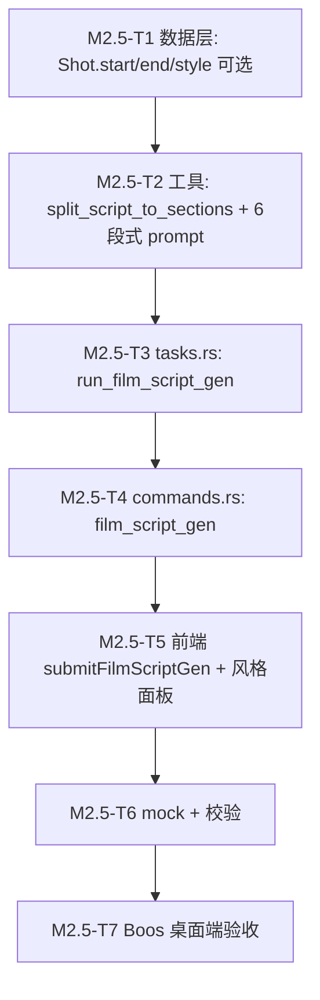

# M2.5 影片解说真链路（ASR→LLM→分镜）设计

> 参考：D:\AIIA\video_analyzer\（"解说猫 v5.2.1"）完整 1028 行流程与界面设计文档
> 主理人：齐活林（Qi）· 2026-07-13

## 一、参考软件核心流程（模式一"上帝视角"，8 步）

```
① 选择视频 + 设置范围
  ↓
② 配置解说参数（风格 15+ / 时长 / 语言 13 / 模型 / 辅助提示 / 智能穿插密度）
  ↓
③ 场景检测（TransNetV2 深度学习，GPU 加速，长视频自动分块，提速 6-10x）
  ↓
④ AI 视频内容分析（Gemini 2.5，并行 5 路，对冲请求，熔断保护）
  ↓
⑤ AI 生成解说文案（流式输出，六段式结构：开端→铺垫→冲突→高潮→反转→结局）
  ↓
⑥ 文案-画面匹配（54 段文案 → 142 个场景，语义匹配 + 时间戳定位 + 覆盖审计）
  ↓
⑦ 分镜工作台（表格式核心编辑界面，单击单元格即编辑，右键菜单）
  ↓
⑧ 配音 + 导出（5 大配音引擎 / 剪映+PR+CapCut+SRT 4 种导出格式）
```

**模式二"文案配视频"**：1-2 步：选视频 + 输入文案 → AI 提纯 → 后续 3-5 步与模式一相同。

## 二、与 VideosFlow M2 现状对比

| 流程 | 参考软件 | VideosFlow M2 现状 | 差距 |
|------|----------|-------------------|------|
| 1. 选视频 | ✅ 多选 + 范围设置 | ✅ 单选 + `tauri-plugin-dialog` | **M2.5 待补**：批量、范围裁剪 |
| 2. 配参数 | ✅ 15+ 风格、时长换算字数、辅助提示 | ❌ 无 UI（隐藏） | **M2.5 待补**：参数面板 |
| 3. 场景检测 | ✅ TransNetV2（深度学习） | ❌ 无 | **M2.5 不做**（需 GPU 依赖；远期 M6 评估） |
| 4. 视频分析 | ✅ Gemini/GPT 视觉 | ❌ 无 | **M2.5 不做**（需视觉模型；M6 评估） |
| **5. 文案生成** | ✅ 流式 + 六段式 + 风格 | ⚠️ **sim 占位**（无真实生成） | **M2.5 主目标**：ASR→LLM 真链路 |
| 6. 文案-画面匹配 | ✅ 语义匹配 + 时间戳 | ❌ 无 | **M2.5 待补**：时间戳回填到分镜 |
| 7. 分镜工作台 | ✅ 表格核心编辑 + 视频联动 | ⚠️ 4 字段可编辑（无表格布局） | **M2.5 增强**：表格式重做 |
| 8. 配音+导出 | ✅ 5 引擎 + 4 格式 | ⚠️ TTS XiaomiMimo 单一 + 剪映 JSON 单一 | **M2.5 不做**（M5 配音） |
| 文案质检 | ✅ 六维评分 + 优化 | ❌ 无 | **M5+ 后续** |
| 智能去重 | ✅ 防搬运变换 | ❌ 无 | **M5+ 后续** |
| 音画强制对齐 | ✅ 双向微调 | ❌ 无 | **M5+ 后续** |

## 三、M2.5 范围（Boos 决策）

### 核心目标
**让"⚡ 自动生成解说文案"按钮真正读取视频内容并生成高质量解说**。

### 流程（M2.5 五步，对齐参考软件模式一 ①+②+⑤+⑥+⑦）

```
1. 选视频（已有：tauri-plugin-dialog）
2. 配置解说参数（新建 UI：风格/时长/语言/辅助提示）
3. ASR 转写（XiaomiMimo 整段文本，无时间戳）
4. 章节切分 + 时间戳回填（章节标题/时间码/段落拆分；预估时长）
5. Agnes LLM 生成六段式解说（注入 ASR + 风格；带时间戳）
6. 落到分镜表（已有 storyboard 字段，扩 cam 字段支持"开场/冲突/高潮/反转/结局"）
```

### 不做（明确边界）
- ❌ 场景检测（需 TransNetV2 + GPU；M6 评估）
- ❌ AI 视频帧分析（需视觉模型；M6 评估）
- ❌ 文案配视频模式二（M4 创作+分镜已实现该模式）
- ❌ 配音系统（M5 范围）
- ❌ 智能去重 / 音画对齐 / 文案质检（M5+ 远期）

## 四、数据模型

### 4.1 新增字段（`storyboards` 表已存在）
- `shots` 字段保持 `JSON.stringify(Shot[])`，Shot 增字段：
  ```typescript
  interface Shot {
    index: number;
    desc: string;       // 画面描述（已有）
    dialogue: string;    // 解说词（已有）
    dur: number;        // 时长（已有）
    cam: string;        // 运镜（已有）→ 兼用作"六段式结构"标签
    start: number;      // 起始时间（秒）—— 新增
    end: number;        // 结束时间（秒）—— 新增
    style: string;      // 风格提示（新增：movie/series/short/etc）
  }
  ```

### 4.2 新增任务类型
- `film_asr`（已有 `transcribe_asr` 工具，复用）
- `film_script_gen`（新增，详见 §五）

## 五、关键算法

### 5.1 章节切分 + 时间戳回填（确定性，Rust 端）

```text
input: asr_text (整段文本) + total_duration (秒)
output: [(start, end, segment_text), ...]  // 4-6 段

1. 按"。" "！" "？" "…" 切句（保留标点）
2. 按目标时长 (3min) 估算字数 (3min ≈ 810 字) → 总段数 = ceil(字数 / 150)
3. 平均切分：每段约 150-200 字，3-6 段
4. 时间戳 = 等分（start = i/total * duration, end = (i+1)/total * duration）
5. 不足 3 段 → 合并为长段；超过 8 段 → 取前 8 段
```

### 5.2 六段式文案生成（Agnes LLM）

```text
prompt 模板（取 settings.prompts.narration）：
"请你为以下视频撰写一段时长 {duration} 分钟的解说文案。
视频标题：{title}
视频转写（来自 ASR）：
{asr_text}
解说风格：{style}（电影解说/电视剧/综艺/动漫/短剧漫剪/高能合辑/口语化/萌讲八道/直播带货/新闻联播/吐槽式/深度解析/慢节奏/悬疑文案）
辅助提示：{hint}

要求：
1. 遵循六段式结构：开端→铺垫→冲突→高潮→反转→结局
2. 每段标注时间戳 [mm:ss-mm:ss]，段长 30-60 字
3. 风格语气自然，匹配观众期待
4. 字数 ≈ {target_chars} 字

返回 JSON 数组 [{start, end, dialogue, section}, ...]
其中 section ∈ {开端, 铺垫, 冲突, 高潮, 反转, 结局}
"
```

### 5.3 降级策略
- ASR 失败（缺 Key / XiaomiMimo 错误）：用视频标题 + 风格直接生成（流式输入无 ASR）
- LLM 失败（缺 Key / Agnes 错误）：用前 N 句 ASR + 模板拼接
- LLM 返回非 JSON：尝试首尾 `[ ]` 抠取，失败再用降级

## 六、IPC 协议

### 6.1 前端 → Rust 命令

```rust
// film_script_gen 任务命令
#[tauri::command(rename_all = "camelCase")]
pub async fn film_script_gen(
    state: State<'_, AppState>,
    project_id: String,
    on_progress: Channel<ProgressMsg>,
) -> Result<String, String>  // 返回 taskId
```

### 6.2 任务 payload
```json
{
  "projectId": "uuid",
  "videoPath": "E:\\...\\movie.mp4",   // 来自 editorState.videoPath
  "title": "城市之光",
  "style": "movie",                    // 默认 "movie"
  "language": "zh",
  "duration": 180,                     // 秒，默认 180（3 分钟）
  "hint": ""                           // 辅助提示
}
```

### 6.3 ProgressMsg payload
```json
{ "script": "完整文案文本" }    // done 时回传
{ "shots": "[{index,start,end,desc,dialogue,dur,cam,style}, ...]" }  // 落库后的分镜 JSON
{ "degraded": true/false }  // 标记降级
```

## 七、文件改动清单

### Rust 端（3 个文件）
| 文件 | 状态 | 改动 |
|------|------|------|
| `db.rs` | 不变 | schema 已有（shots 是 JSON 字符串） |
| `commands.rs` | 【修改】 | 新增 `film_script_gen` 任务命令（1 个） |
| `tasks.rs` | 【修改】 | `run_job` match 新增 `film_script_gen` 分支 + `run_film_script_gen` 函数 + `split_script_to_sections` 工具 + `generate_narration_prompt` 工具（共用 `run_llm_text`） |
| `lib.rs` | 【修改】 | 注册 `film_script_gen` 命令 |

### 前端（3 个文件）
| 文件 | 状态 | 改动 |
|------|------|------|
| `modules/Film.tsx` | 【修改】 | "自动生成解说文案"按钮改调 `submitFilmScriptGen`；"导入对齐"步骤重构：上传 → 风格面板 → 异步生成 |
| `state/AppContext.tsx` | 【修改】 | `genFilmScript` 改异步 `submitFilmScriptGen(projectId, opts, onProgress)`，onProgress 写 editorState.script + storyboard |
| `ipc/{client,providers,types}.ts` | 【修改】 | mock + IPC + 类型 |
| `data/mock.ts` | 【修改】 | `Shot` 加 `start/end/style` 可选字段 |

## 八、任务依赖图



## 九、待 Boos 拍板（5 个）

| # | 决策 | 推荐默认 |
|---|------|----------|
| 1 | **章节切分粒度** | 3-6 段、目标 150 字/段、6 段式结构（开端/铺垫/冲突/高潮/反转/结局） |
| 2 | **解说风格预设** | 沿用 12 个 M3 风格（电影/电视剧/综艺/动漫/短剧/高能/口语/萌讲/直播/新闻/吐槽/悬疑）—— **比参考软件的 15 少 3 个**（暂不做直播带货/深度解析/慢节奏） |
| 3 | **时长估算策略** | 固定 3 分钟 ≈ 810 字（用户后续可在参数面板调整） |
| 4 | **降级顺序** | ① ASR 失败 → 用视频标题生成 ② LLM 失败 → 用 ASR 前 810 字直接拼接 ③ 都失败 → 当前 sim 占位 |
| 5 | **辅助提示（hint）字段** | 暂不暴露 UI 字段（M2.5 范围外；M5 文案质检再做） |

## 十、关键设计决策 vs 参考软件

| 项 | 参考软件 | M2.5 方案 | 取舍 |
|----|----------|----------|------|
| 视觉模型 | Gemini 2.5 Flash | ❌ 不做（需视觉 API + 成本高） | MVP 跳过 |
| 场景检测 | TransNetV2 | ❌ 不做（需 GPU 模型） | MVP 跳过 |
| 章节切分 | LLM 自己切 | Rust 端按字数等分 + 时间戳回填 | 确定性、快 |
| 时间戳精度 | ASR 带时间戳 | 整段文本无时间戳 → 等分估算 | 接受（M3 ASR 限制） |
| 文案流式输出 | 流式（streamGenerateContent） | **非流式**（Agnes 暂未验证流式） | MVP 跳过 |
| 文案质检 | 六维评分 | ❌ 不做 | M5+ 远期 |
| 配音系统 | 5 引擎 | ❌ 不做 | M5 范围 |
| 多格式导出 | 剪映+PR+CapCut+SRT | 沿用 M2 剪映 JSON | 后续 |

## 十一、验收门槛

- **桌面端跑通**：上传 mp4 → 点"自动生成解说文案"→ 看到 4-6 段带时间戳的文案 + 分镜表 4-6 行
- **耗时**：3 分钟视频 < 90 秒（ASR 30s + LLM 30s + 切分 < 5s）
- **降级路径**：缺 Key / 网络断 → UI 显示"降级文案"+ 任务栏警告
- **可重复**：已生成文案的工程再点按钮 → 重新生成

---

_编制：齐活林（Qi） · 2026-07-13 · v1.0_
_配套：README.md / m2-film-design.md（M2 旧版） / dev-plan-next.md（下一步计划）_