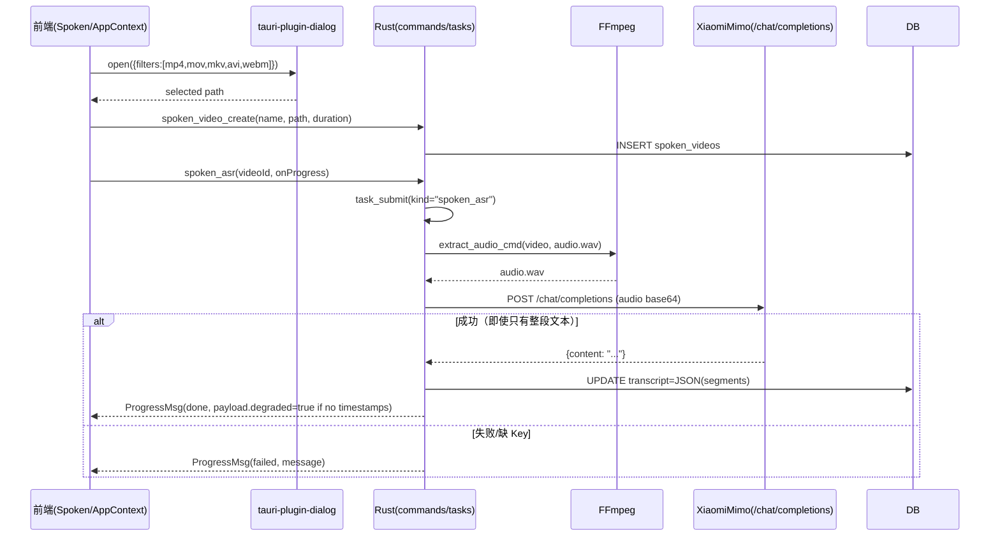
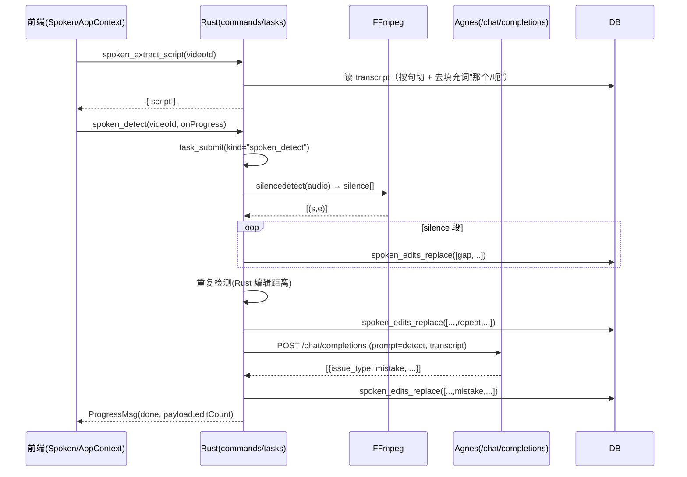
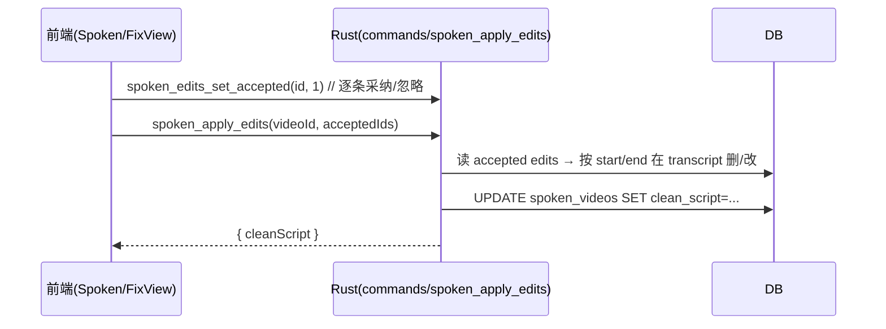
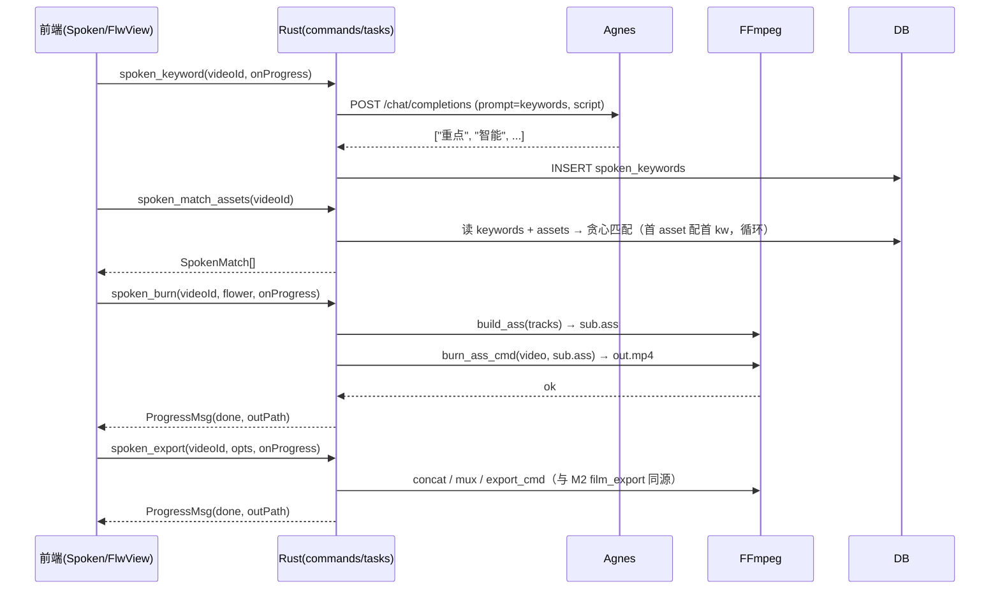
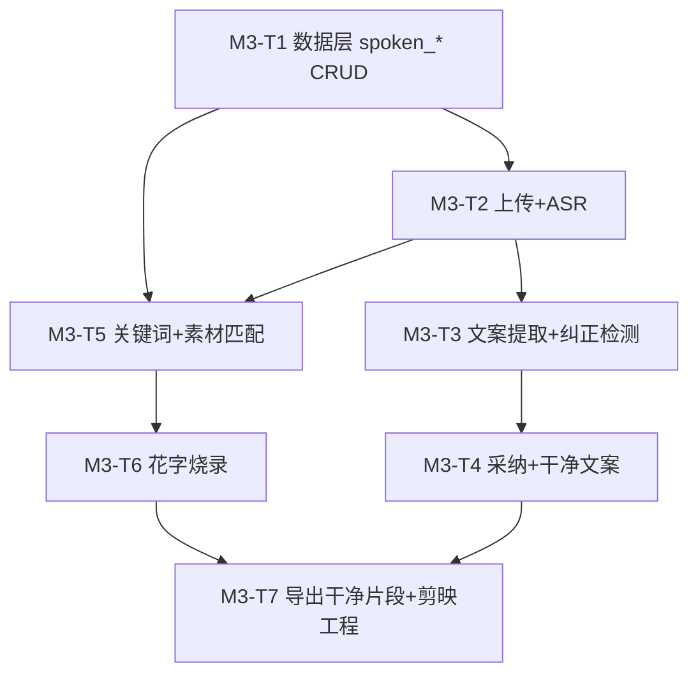

# M3 口播模块 · 系统架构设计与任务分解

> 架构师：高见远（software-architect）｜主理人：齐活林（Qi）
> 配套基线：`docs/dev-plan.md` §M3 / `docs/technical-solution.md` §3.2·§6.1·§6.2·§6.3·§7·§8 / `docs/m2-film-design.md`
> 范围：上传口播 → 抽音轨 → ASR 转写 → 文案提取 → 气口/口误/重复检测 → 采纳/忽略 → 关键词 + 花字烧录 → 导出干净片段 + 剪映工程

---

## 1. 实现方案 + 框架选型（沿用 M2 既有栈，说明 M3 新增点）

### 1.1 技术栈（沿用，不引入新框架）
| 层 | 技术 | 说明 |
|----|------|------|
| 桌面外壳 | Tauri 2 + Rust 1.78+ | 沿用，新增口播命令/任务 |
| 前端 | React 18 + Vite + TS | 沿用 AppContext + ipc 三件套 |
| 持久层 | sqlx + SQLite | M0 已建 12 表，`spoken_videos` / `spoken_edits` 已有 schema，补 CRUD |
| 编排/异步 | tokio + reqwest + Tauri Channel | 任务队列已就绪，新增口播任务类型 |
| 媒体 | FFmpeg 7.x | `ffmpeg.rs` 已有抽音轨/静音检测/拼接/烧字幕/导出，本期复用 |
| AI 网关 | Rust reqwest 直连云端 | **M3 不再依赖 Python sidecar**：ASR 走 XiaomiMimo（同 M2 影片 ASR），口误检测/关键词抽取走 Agnes LLM |
| 密钥 | keyring（系统凭据库） | 沿用 `cred.rs`，绝不落 SQLite 明文 |
| UI | Editorial Design System v3.0（自研 global.css + Lucide） | 沿用，5 步 UI 已存在 |

### 1.2 M3 相对 M0–M2 的新增点

1. **Rust 数据层**：`db.rs` 补 `spoken_videos` / `spoken_edits` 两表 CRUD（已有表结构，补函数）。
2. **Rust 命令层**：`commands.rs` 新增 `spoken_video_*` / `spoken_asr_transcribe` / `spoken_extract_script` / `spoken_detect_issues` / `spoken_apply_edits` / `spoken_set_issue` / `spoken_keyword_extract` / `spoken_match_assets` / `spoken_apply_match` / `spoken_flower_burn` / `spoken_export_clean` / `spoken_export_jianying`，在 `lib.rs` 注册。
3. **Rust 任务层**：`tasks.rs` 的 `run_job` 新增 `spoken_asr` / `spoken_detect` / `spoken_flower_burn` / `spoken_export` 4 个任务类型，复用 `ProgressMsg` 通道。
4. **FFmpeg 编排**：`ffmpeg.rs` 已具备 `extract_audio_cmd` / `silence_cmd` / `concat_cmd` / `burn_ass_cmd` / `export_cmd`；M3 主要复用，M3-T6 花字烧录复用 `build_ass`。
5. **AI 网关**：M3 不引入 Python sidecar，**复用 M2 的 Rust reqwest 直连**：
   - ASR：XiaomiMimo `/chat/completions`（音频 wav base64 入 `messages[].input_audio`），由 `tasks.rs::transcribe_asr` 复用（M2 已实现）。
   - 口误检测 / 关键词抽取：Agnes `/chat/completions`，封装 `run_llm_json(prompt, json_schema)` 工具函数；任务列表 4 个 LLM 任务统一走这条。
6. **前端接线**：
   - `modules/Spoken.tsx` 5 步 UI 重构：`sim()` 全部替换为真实 IPC（上传 → 识别 → 纠正 → 匹配素材 → 花字字幕）。
   - `state/AppContext.tsx` 增加口播视频加载/选中 actions，删除 `sim()` 模拟实现。
   - `data/mock.ts` 新增口播领域类型 `SpokenVideoRow` / `SpokenEditRow` / `SpokenIssueKind`；`initialSpokenVideos` 标记为 dev fallback（仅 `npm run dev` 用）。
   - `ipc/types.ts` 新增 `SpokenVideo` / `SpokenEdit` / `SpokenIssue` / `SpokenMatch` / `SpokenAsset` / `SpokenKeyword` / `SpokenExportOptions`。
   - `ipc/client.ts` mock 同步新增 13 个命令 + 4 个任务类型模拟（保证纯 `npm run dev` 不崩）。
   - `ipc/providers.ts` 新增 `loadSpokenVideos / createSpokenVideo / deleteSpokenVideo / submitSpokenAsr / submitSpokenDetect / submitSpokenKeyword / submitSpokenBurn / submitSpokenExport / setSpokenIssue / applySpokenEdits / toggleSpokenMatch` 等高层封装。
7. **新组件**：`components/IssueRow.tsx`（纠正行：采纳/忽略双选 + 删除/保留预览）+ `components/AssetChip.tsx`（素材库 chip：四类图片/BGM/音效/片段），从 `Spoken.tsx` 拆出保持组件纯净。

### 1.3 关键算法落点决策（见 §8 论证）
- **ASR**：复用 M2 的 `transcribe_asr`（XiaomiMimo），降级 `degraded=true` 时生成"无逐句时间戳"的单 segment ASR，前端文案提取用规则去填充词 + 标点切句兜底，不阻塞识别步骤。
- **气口检测（gap）**：**Rust 端确定性**（FFmpeg `silencedetect` + 静音段分类），与 M2 影片粗剪同源。
- **口误/卡顿检测（mistake）**：**LLM 端云端**（Agnes `mistake` 提示词，返回带 `span/suggestion/text` 的 JSON 数组）；失败时降级返回空数组，UI 提示"检测暂不可用"。
- **重复检测（repeat）**：**Rust 端确定性**（相邻句编辑距离 ≥ 0.7 或语义相似度 ≥ 0.85 触发），不消耗 LLM 配额；这是 M3 设计的核心省钱点。
- **关键词抽取（keyword）**：**LLM 端云端**（Agnes `keywords` 提示词）；失败降级用 TF-IDF 简单排序取 top 5。
- **花字烧录**：**Rust 端确定性**（FFmpeg `ass=` filter），复用 `ffmpeg.rs::build_ass`（M2 已实现 6 套模板），无需 LLM。
- **剪映工程导出**：前端构造 `draft_content.json`（沿用 M2 Spoken 已有的 `exportSpokenJianYing` mock 逻辑），M3 把它从 mock 升级为正式前端构造 + 真实下载。

### 1.4 与 M2 共享的关键不变量
- 时间单位统一**秒（float）**；tRPC/IPC 信封 `Result<T, String>`；任务状态 `queued → running → done | failed`；进度 `0–100` + `message`。
- 任何新增 IPC 命令必须在 `mockInvoke` 同步实现回退；任何新增任务类型必须在 mock 的 `task_submit` 分支模拟进度推送。
- API Key 走 `cred::get_key("asr" | "llm")` 取系统凭据库，绝不落 SQLite 明文，绝不进 `mock.ts` 初始值。

---

## 2. 文件列表及相对路径（标注【新增】/【修改】）

### 2.1 Rust（`src-tauri/src/`）
| 文件 | 状态 | M3 改动 |
|------|------|---------|
| `db.rs` | 【修改】 | 新增 `SpokenVideoRow` / `SpokenEditRow` 类型 + 5 个 CRUD：`spoken_video_list` / `spoken_video_create` / `spoken_video_delete` / `spoken_edits_list` / `spoken_edits_set_accepted` / `spoken_clean_script_set` |
| `commands.rs` | 【修改】 | 新增 13 个命令（见 §1.2(2)），`lib.rs` 注册 |
| `tasks.rs` | 【修改】 | `run_job` 新增 `spoken_asr` / `spoken_detect` / `spoken_keyword` / `spoken_burn` / `spoken_export` 5 个分支 + 对应 `run_*` 函数 + 通用 `run_llm_json(prompt, schema)` 工具 |
| `ffmpeg.rs` | 不变 | 复用（`extract_audio_cmd` / `silence_cmd` / `build_ass` / `burn_ass_cmd` / `concat_cmd` / `export_cmd`） |
| `python.rs` | 不变 | M2 已移除 sidecar |
| `cred.rs` | 不变 | 沿用 |
| `main.rs` | 不变 | — |

### 2.2 前端（`src/`）
| 文件 | 状态 | M3 改动 |
|------|------|---------|
| `modules/Spoken.tsx` | 【修改】 | 5 步 UI 重构：UploadView 改为 `tauri-plugin-dialog` 文件选择 + 真实 ASR 任务；FixView 改为读 `spoken_edits` + 真实 `setIssue` / `applyEdits`；MatchView 改为调真实 `submitSpokenKeyword` + `toggleMatch`；FlwView 改为读真实关键词 + 烧录按钮接 `submitSpokenBurn` + 导出按钮接 `submitSpokenExport` / `exportJianYing` |
| `state/AppContext.tsx` | 【修改】 | 增 `loadSpoken / createSpoken / deleteSpoken / setSpokenIssue / applySpokenEdits / submitSpokenAsr / submitSpokenDetect / submitSpokenKeyword / submitSpokenBurn / submitSpokenExport / toggleSpokenMatch / exportSpokenJianying` 等 actions；删除原 `sim()` 实现；启动 effect 调 `loadSpoken()` |
| `data/mock.ts` | 【修改】 | 新增 `SpokenVideoRow` / `SpokenEditRow` 类型 + 5 套常用词关键词种子；`initialSpokenVideos` 仍作为 dev fallback，但标记 `__dev_only: true` |
| `ipc/types.ts` | 【修改】 | 新增 `SpokenVideo` / `SpokenEdit` / `SpokenIssueKind` / `SpokenMatch` / `SpokenAsset` / `SpokenKeyword` / `SpokenExportOptions` |
| `ipc/client.ts` | 【修改】 | `mockInvoke` 新增 13 个口播命令分支 + 5 个任务类型模拟 |
| `ipc/providers.ts` | 【修改】 | 新增 12 个高层封装 |
| `components/IssueRow.tsx` | 【新增】 | 纠正行组件（采纳/忽略双选 + 删除预览） |
| `components/AssetChip.tsx` | 【新增】 | 素材库 chip（4 类） |

### 2.3 Python sidecar（`python-sidecar/`）
**M3 不引入 Python sidecar**（M2 已彻底移除）。所有 AI 调用均经 Rust reqwest 直连：`tasks.rs::transcribe_asr`（XiaomiMimo）+ 新增 `tasks.rs::run_llm_json`（Agnes）。

---

## 3. 数据结构和接口（Mermaid 类图 / ER 图 + 函数签名）

### 3.1 数据库表 → 领域模型（沿用 §7 字段名）
```mermaid
erDiagram
    spoken_videos {
        TEXT id PK
        TEXT path
        REAL duration
        TEXT transcript  // JSON.stringify(AsrSegment[])
        TEXT script      // 提取的纯文案
        TEXT clean_script // 干净文案
        INTEGER created_at
    }
    spoken_edits {
        TEXT id PK
        TEXT video_id FK
        TEXT issue_type  // gap | mistake | repeat
        REAL start       // 起始时间(秒)
        REAL end         // 结束时间(秒)
        TEXT text        // 原文
        TEXT suggestion  // 建议
        INTEGER accepted DEFAULT 0  // 0 待定 / 1 采纳 / -1 忽略
    }
    spoken_videos ||--o{ spoken_edits : video_id
```

### 3.2 领域类型（前端 `ipc/types.ts`）
```typescript
type SpokenIssueKind = 'gap' | 'mistake' | 'repeat';

interface SpokenVideo {
  id: string;
  name: string;          // 原始文件名
  path: string;          // 绝对路径
  duration: number;      // 秒
  transcript: AsrSegment[]; // 与 M2 影片共享 AsrSegment
  script: string | null; // 提取的纯文案
  cleanScript: string | null; // 干净文案（采纳后）
  createdAt: number;
}

interface SpokenEdit {
  id: string;
  videoId: string;
  issueType: SpokenIssueKind;
  start: number;
  end: number;
  text: string;
  suggestion: string;
  accepted: 0 | 1 | -1;  // 0 待定 / 1 采纳 / -1 忽略
}

interface SpokenMatch {
  id: string;
  videoId: string;
  segStart: number;
  segEnd: number;
  segText: string;
  keyword: string;
  assetId: string | null; // 关联 asset
  applied: boolean;
}

interface SpokenAsset {
  id: string;
  videoId: string;
  name: string;
  type: 'image' | 'bgm' | 'sfx' | 'clip';
  path: string;
}

interface SpokenKeyword {
  id: string;
  videoId: string;
  text: string;
  weight: number; // LLM 评分 0-1
}

interface SpokenExportOptions {
  burnFlower: boolean;
  mixVoice: boolean;
  flower: string;       // 花字模板 id
  resolution: string;   // 1920x1080 等
}
```

### 3.3 spoken_* 函数签名（`db.rs`）
```rust
// ---- spoken_videos ----
pub async fn spoken_video_list(pool: &SqlitePool) -> Result<Vec<SpokenVideoRow>, String>;
pub async fn spoken_video_create(pool: &SqlitePool, name: &str, path: &str, duration: f64) -> Result<String, String>;
pub async fn spoken_video_delete(pool: &SqlitePool, id: &str) -> Result<(), String>;
pub async fn spoken_video_set_script(pool: &SqlitePool, id: &str, script: &str) -> Result<(), String>;
pub async fn spoken_video_set_clean(pool: &SqlitePool, id: &str, clean_script: &str) -> Result<(), String>;
pub async fn spoken_video_set_transcript(pool: &SqlitePool, id: &str, transcript_json: &str) -> Result<(), String>;

// ---- spoken_edits ----
pub async fn spoken_edits_list(pool: &SqlitePool, video_id: &str) -> Result<Vec<SpokenEditRow>, String>;
pub async fn spoken_edits_replace(pool: &SqlitePool, video_id: &str, edits_json: &str) -> Result<(), String>; // 整体替换（detected 后写入）
pub async fn spoken_edits_set_accepted(pool: &SqlitePool, id: &str, accepted: i64) -> Result<(), String>; // 单条采纳/忽略
```

> `SpokenVideoRow` 含 `transcript: String`（JSON 序列化的 `AsrSegment[]`，前端解析）。 `start/end` 默认 0 时表示全句（口播 ASR 单段无时间轴时，gap/repeat 仅基于句索引兜底）。

### 3.4 IPC 命令契约（前端 → Rust）
```typescript
// 列表
invoke('spoken_video_list') → SpokenVideo[]
// 上传（前端先调 tauri-plugin-dialog 拿路径，再调）
invoke('spoken_video_create', { name, path, duration }) → string  // 返回 id

// 识别（异步任务）
invoke('spoken_asr', { videoId, onProgress }) → string  // taskId
// 提取文案（同步，根据 transcript 算）
invoke('spoken_extract_script', { videoId }) → { script: string }

// 检测（异步任务：气口走 FFmpeg + 重复走 Rust；口误走 Agnes LLM）
invoke('spoken_detect', { videoId, onProgress }) → string  // taskId
// 应用编辑（采纳 → 生成 cleanScript）
invoke('spoken_apply_edits', { videoId, acceptedIds: string[] }) → { cleanScript: string }
// 单条采纳/忽略（用于 FixView 行内交互）
invoke('spoken_edits_set_accepted', { id, accepted }) → void

// 关键词抽取（异步任务）
invoke('spoken_keyword', { videoId, onProgress }) → string  // taskId
// 素材匹配（同步，根据 keywords + assets 做最简匹配）
invoke('spoken_match_assets', { videoId }) → SpokenMatch[]
invoke('spoken_match_toggle', { matchId, applied }) → void

// 花字烧录（异步任务）
invoke('spoken_burn', { videoId, flower, onProgress }) → string  // taskId
// 导出干净片段
invoke('spoken_export', { videoId, opts, onProgress }) → string  // taskId → outPath
// 剪映工程导出（前端构造 draft_content.json + 下载）
invoke('export_jianying', { videoId }) → string  // 返回构造的 JSON（前端负责下载）
```

### 3.5 任务类型与进度消息（复用 M2 `ProgressMsg`）
```typescript
type SpokenTaskKind =
  | 'spoken_asr'      // 抽音轨 → XiaomiMimo ASR → 写 transcript
  | 'spoken_detect'   // FFmpeg silencedetect(gap) + Rust 编辑距离(repeat) + Agnes LLM(mistake) → 写 spoken_edits
  | 'spoken_keyword'  // Agnes LLM 关键词抽取 → 写 spoken_keywords
  | 'spoken_burn'     // FFmpeg ass= 烧录 + 输出 mp4
  | 'spoken_export';  // FFmpeg concat + mux + export → 输出 mp4

interface ProgressMsg {
  taskId: string;
  progress: number;     // 0-100
  status: 'queued' | 'running' | 'done' | 'failed';
  message?: string;
  payload?: { script?: string; keywords?: string[]; outPath?: string; degraded?: boolean };
}
```

### 3.6 重复检测算法（Rust 端确定性）
```text
编辑距离法（a,b 两句）：
  ratio = 1 - edit_distance(a, b) / max(len(a), len(b))
  当 ratio >= 0.85 视为完全重复；0.7 <= ratio < 0.85 视为啰嗦

句法：
  for i in 1..n:
    ratio = ratio(tr[i-1], tr[i])
    if ratio >= 0.7:
      emit(repeat, span=(tr[i-1].end ?? tr[i-1].start, tr[i].end ?? tr[i].start), suggestion="删除/合并重复", accepted=0)

注意：当 ASR 仅返回整段文本（XiaomiMimo 现状），tr[i].end 默认为 0；此时 start/end 均按 tr[i].start 兜底，重复判定仍可工作。
```

### 3.7 气口检测算法（Rust 端确定性，复用 M2 silencedetect）
```text
audio = ffmpeg_extract(in.mp4)
silence = ffmpeg_silencedetect(audio, noise=-35dB, duration=0.4)
for (s, e) in silence:
  emit(gap, span=(s, e), suggestion=f"静音段 {fmt(s)}-{fmt(e)}，建议裁剪", accepted=0)
```

---

## 4. 程序调用流程（Mermaid 时序图）

### 4.1 上传 + ASR 链路


### 4.2 文案提取 + 纠正检测链路


### 4.3 采纳 + 干净文案生成


### 4.4 关键词 + 素材匹配 + 花字烧录 + 导出


---

## 5. 任务列表（有序、含依赖、按实现顺序）— 核心交付

> 每个任务至少跨 3 个文件；所有命令/任务类型须同步扩展 `ipc/client.ts` 的 mock（保证纯 `npm run dev` 不崩）。

### M3-T1 · 数据层：spoken_* CRUD
- **目标**：在 `db.rs` 落地 `spoken_videos` / `spoken_edits` 两表全量 CRUD；`commands.rs` 暴露命令并 `lib.rs` 注册。
- **涉及文件**：`src-tauri/src/db.rs`【修改】、`src-tauri/src/commands.rs`【修改】、`src-tauri/src/lib.rs`【修改】、`src/ipc/client.ts`【修改】。
- **依赖**：M0（12 表已建）。
- **验收点**：经 `invoke` 真实读写 SQLite；mock 模式下 localStorage 等价结果；`npm run build` 零错误。

### M3-T2 · 上传 + ASR 接入
- **目标**：前端"上传"按钮接 `tauri-plugin-dialog` 真实文件选择 → `spoken_video_create` 写入 DB → `spoken_asr` 任务走 `transcribe_asr`（复用 M2）→ transcript 落库；前端展示转写句列表 + 波形。
- **涉及文件**：`src-tauri/src/commands.rs`【修改】、`src-tauri/src/tasks.rs`【修改】（新增 `run_spoken_asr`）、`src/modules/Spoken.tsx`【修改】、`src/state/AppContext.tsx`【修改】、`src/ipc/types.ts`【修改】、`src/ipc/providers.ts`【修改】、`src/ipc/client.ts`【修改】。
- **依赖**：T1。
- **验收点**：上传 mp4 → 抽音轨 → XiaomiMimo ASR 返回文本 → transcript 落库（即使 `degraded=true` 也写库单 segment）→ 前端展示句列表 + 关键句波形；进度经 Channel 实时回传；失败 message 可读。

### M3-T3 · 文案提取 + 纠正检测
- **目标**：`spoken_extract_script` 同步从 transcript 算纯文案（按 `。！？!?，,；;\n` 切 + 去填充词）；`spoken_detect` 任务组合"FFmpeg silencedetect（gap） + Rust 编辑距离（repeat） + Agnes LLM（mistake）"写入 `spoken_edits`。
- **涉及文件**：`src-tauri/src/db.rs`【修改】（`spoken_edits_replace`）、`src-tauri/src/commands.rs`【修改】、`src-tauri/src/tasks.rs`【修改】（新增 `run_spoken_detect` + `detect_repeat` Rust 函数 + `run_llm_json` 工具）、`src/modules/Spoken.tsx`【修改】、`src/state/AppContext.tsx`【修改】、`src/ipc/client.ts`【修改】。
- **依赖**：T2（需 transcript）。
- **验收点**：gap/repeat/mistake 三类 issue 全部写入 spoken_edits 且 id 唯一；前端 FixView 列表与统计正确；mock 模式可点验；mistake 降级（Agnes 不可达）不阻塞 repeat/gap 检测。

### M3-T4 · 采纳/忽略交互 + 干净文案生成
- **目标**：`spoken_edits_set_accepted` 单条采纳/忽略（行内交互）；`spoken_apply_edits` 一键应用所有 accepted=1 的 edits，按 start/end 在 transcript 删/改 → 生成 cleanScript。
- **涉及文件**：`src-tauri/src/commands.rs`【修改】、`src-tauri/src/db.rs`【修改】、`src/modules/Spoken.tsx`【修改】、`src/state/AppContext.tsx`【修改】、`src/ipc/client.ts`【修改】、`src/components/IssueRow.tsx`【新增】。
- **依赖**：T3。
- **验收点**：单条/全部采纳/全部忽略交互正确；一键生成 cleanScript 预览；"不破坏原片"（transcript 字段不变，只填 clean_script）。

### M3-T5 · 关键词抽取 + 素材匹配
- **目标**：`spoken_keyword` 任务走 Agnes LLM `keywords` 提示词抽取关键词（top 5–8）；`spoken_match_assets` 同步做"关键词 ↔ 素材"贪心匹配（按 type 优先 image）。
- **涉及文件**：`src-tauri/src/commands.rs`【修改】、`src-tauri/src/tasks.rs`【修改】（新增 `run_spoken_keyword`）、`src/modules/Spoken.tsx`【修改】、`src/state/AppContext.tsx`【修改】、`src/ipc/types.ts`【修改】、`src/ipc/providers.ts`【修改】、`src/ipc/client.ts`【修改】。
- **依赖**：T2。
- **验收点**：关键词写入 spoken_keywords（带 weight）；MatchView 列表显示"句 ↔ 关键词 ↔ 素材"三元组；关键词抽取降级（Agnes 不可达）走 TF-IDF 兜底，不阻塞匹配。

### M3-T6 · 花字烧录（前端预览 + 后端渲染）
- **目标**：FlwView 实时预览（沿用 M2 既有预览算法：`<span class="flw {cls}">`）；`spoken_burn` 任务调用 `ffmpeg.rs::build_ass` 生成 ASS + `burn_ass_cmd` 烧录到视频。
- **涉及文件**：`src-tauri/src/commands.rs`【修改】、`src-tauri/src/tasks.rs`【修改】（新增 `run_spoken_burn`）、`src/modules/Spoken.tsx`【修改】、`src/state/AppContext.tsx`【修改】、`src/ipc/client.ts`【修改】。
- **依赖**：T2/T5。
- **验收点**：6 套花字模板均可烧录；输出 mp4 可见花字；进度经 Channel 实时回传。

### M3-T7 · 干净片段导出 + 剪映工程导出
- **目标**：`spoken_export` 任务：基于 accepted=1 edits 切片段 → concat → export_cmd 输出 mp4；前端构造 `draft_content.json`（视频轨 + 字幕/花字轨）+ 下载。
- **涉及文件**：`src-tauri/src/commands.rs`【修改】、`src-tauri/src/tasks.rs`【修改】（新增 `run_spoken_export`）、`src/modules/Spoken.tsx`【修改】、`src/state/AppContext.tsx`【修改】、`src/ipc/client.ts`【修改】、`src/lib/jianying.ts`【修改】（提取 `buildSpokenDraft(videoId, acceptedEdits)` 工具函数）。
- **依赖**：T4/T6。
- **验收点**：导出干净 mp4（无气口/口误/重复）；剪映工程文件可导入剪映继续精修；输出文件可播放。

### 任务依赖图


---

## 6. 依赖包列表（沿用 M2，零新增）

| 层 | 沿用 | M3 新增 |
|----|------|---------|
| Rust crate | tauri(2)、sqlx(0.8, sqlite)、reqwest(0.12, rustls)、tokio(1)、serde/serde_json(1)、keyring(3)、uuid(1, v4)、base64(0.22) | **无新增** |
| npm | react(18)、react-dom(18)、vite(5)、@tauri-apps/api(2)、@tauri-apps/plugin-dialog(2.7, M2 已引入)、lucide-react(1.24, M2 已引入)、typescript(5) | **无新增** |
| Python sidecar | — | **M3 不引入 sidecar**（M2 已移除） |

---

## 7. 共享知识（跨文件约定）

1. **时间单位统一秒（float）**：`spoken_edits.start/end` 为浮点秒；前端展示用 `m:ss` 格式（复用 M2 TimelineEditor 的 `fmt`）。
2. **降级策略红线**：
   - ASR 失败 → `degraded=true`，仍写 transcript（单段），不阻塞下游（文案提取可用规则兜底）。
   - Agnes LLM 失败（mistake/keyword） → 返回空数组/空关键词，对应步骤 UI 提示"检测暂不可用"。
   - FFmpeg 缺失 → 任务 `failed` 返回 "FFmpeg 未就绪，请先在设置页配置首启下载或放置 ffmpeg 到 PATH"，不阻塞其他任务。
3. **不破坏原片**：spoked_edits.accepted 状态独立存储；transcript 永不修改；clean_script 仅在 `apply_edits` 时按 accepted=1 计算填充。
4. **前端 mock 红线**：13 个口播命令 + 5 个任务类型必须在 `ipc/client.ts::mockInvoke` 同步实现；mock 数据形态与真实 DB 行严格对齐（`SpokenVideoRow` camelCase）。
5. **错误传递**：`Result<T, String>`（Rust）→ 前端 `try/catch` + `task(label, 100)` 显示 message；LLM 调用失败用 `failed` 状态回传 `message: 'Agnes 返回 5xx: ...'`。
6. **花字烧录约定**：复用 M2 `ffmpeg.rs::build_ass` 与 6 套 ASS 样式；spoken 烧录的字幕时间轴用 `tr[i].end ?? tr[i+1].start ?? total` 兜底（与口播现有 mock 逻辑一致）。
7. **剪映工程导出**：前端构造 `draft_content.json`（视频轨 + 字幕/花字轨），文件名固定 `draft_content.json`，浏览器端触发下载；Rust 端不参与（避免 base64 序列化大视频）。

---

## 8. 待明确事项（建议 + Boos 拍板项）

### Q1 · 重复检测放 Rust 端（确定性算法）是否认可？
- **现状**：XiaomiMimo ASR 仅返回整段文本、无逐句时间轴（已知限制）。
- **建议**：**Rust 端编辑距离法**（相邻句 `1 - edit_distance / max(len) ≥ 0.7`），不依赖 LLM；M2 已示范"确定性算法省 LLM 配额"。
- **需 Boos 确认**：是否接受纯编辑距离（不引入语义相似度）；若引入语义相似度需新引入 embedding 网关，复杂度上升。

### Q2 · mistake 检测是纯 LLM 还是 VAD + LLM 混合？
- **建议**：**纯 Agnes LLM**（口误/卡顿主观性强，规则难兜底）；失败时降级返回空数组。LLM 提示词已内置于 `settings.prompts.detect`，M3 直接调用。
- **替代方案**：VAD + 语速异常检测（Rust 端）+ Agnes LLM 复核（云端）—— 准确率更高但成本翻倍，建议先纯 LLM，效果不佳再升级。
- **需 Boos 确认**：是否先用纯 LLM 跑通？

### Q3 · 干净片段导出是否"基于原片裁剪" vs "重建时间线后导出"？
- **建议**：**基于原片裁剪**：保留原视频，仅按 accepted=1 的 edits 删除对应片段 + 重拼接，速度快、无重编码。Rust 端 `segment_cmd` + `concat_cmd` 复用。
- **替代方案**：重建时间线后导出（与 M2 film_export 一致）—— 灵活但慢；适合后续做花字烧录一起导出。
- **需 Boos 确认**：M3 是否先做"基于原片裁剪"+"花字烧录"两步独立导出？

### Q4 · 关键词抽取的"降级为 TF-IDF"是否做？
- **建议**：**做**。理由：M3 用户体验是"上传 → 几秒后看到关键词"，LLM 不可达时立刻显示降级关键词比长时间空白好。TF-IDF 60 行 Rust 代码即可（jieba 或简单 ngram）。
- **需 Boos 确认**：是否接受 TF-IDF 兜底；或更激进地"没 LLM 就提示去设置页填 Key"。

### Q5 · 素材上传是否支持真实文件落盘 vs 仅命名模拟？
- **现状**：M2 之前 UI 是 mock（按类型循环命名"素材1.png"）。
- **建议**：**真实文件落盘**（用 `tauri-plugin-fs` 把上传文件复制到 `data_dir/spoken_assets/{videoId}/`），便于后续导出时引用真实路径。
- **需 Boos 确认**：M3 是否做真实文件落盘；若不做，素材匹配只展示不引用真实文件，导出时仅生成剪映工程不导出 mp4。

### 汇总待确认清单（回传主理人）
1. 重复检测用 Rust 端编辑距离（确定性）是否认可。
2. mistake 检测用纯 Agnes LLM（失败降级）是否认可。
3. 干净片段导出用"基于原片裁剪"是否认可。
4. 关键词抽取的 TF-IDF 兜底是否做。
5. 素材上传是否做真实文件落盘。

---

## 9. 已确认决策（Boos 拍板 · 2026-07-13）

主理人汇编后，Boos 对 §8 五项做出如下拍板，工程师按此实施：

| 项 | 决策 | 对实施的影响 |
|----|------|------|
| Q1 · 重复 + mistake 检测算法 | **Rust 端编辑距离（重复）+ Agnes LLM（mistake）**：零网络成本省 token，mistake 主观性强交 LLM 最准 | T3 实现 `detect_repeat` Rust 函数（编辑距离法）+ `run_llm_json` 工具调 Agnes `mistake` 提示词；失败降级返回空数组 |
| Q2 · 干净片段导出 | **基于原片裁剪（segment + concat）**：保留原视频，无重编码，速度快 | T7 复用 `segment_cmd` + `concat_cmd`，按 accepted=1 的 edits 切片段再拼；不重建时间线 |
| Q3 · 关键词降级 | **TF-IDF（Rust ngram）兜底 + 缺 Key 提示去设置页**：LLM 不可达立刻显示 top 5 关键词，缺 Key 时不进入匹配 | T5 新增 `extract_keywords_tfidf` Rust 函数（~60 行）；key 缺失时任务 `failed` 提示"请先在设置页保存 LLM API Key" |
| Q4 · 素材落盘 | **真实文件落盘 + 类型自动判断**：用 tauri-plugin-fs 复制到 data_dir/spoken_assets/{videoId}/，导出可引用真实路径 | T2 新增 `spoken_asset_upload` 命令 + 类型嗅探（扩展名 + 文件 magic 头），落盘后写 `spoken_assets` 表 |
| Q5 · 素材类型自动判断 | **同 Q4**：扩展名 + magic 头嗅探 | T2 同上 |

> 结论：M3 按 **T1 → T7 全量实施**，按上述拍板方案落地；M3 不再阻塞 M2 影片链路，可独立并行推进。

---

_编制：架构师 高见远 ｜ 对齐基线 14b8e34（M0–M2） ｜ 2026-07-13_