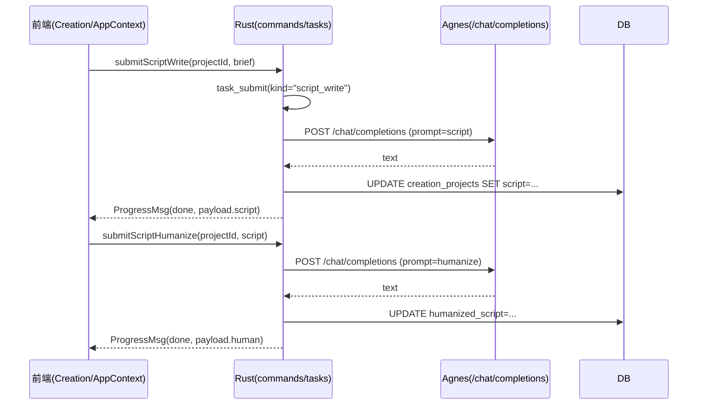
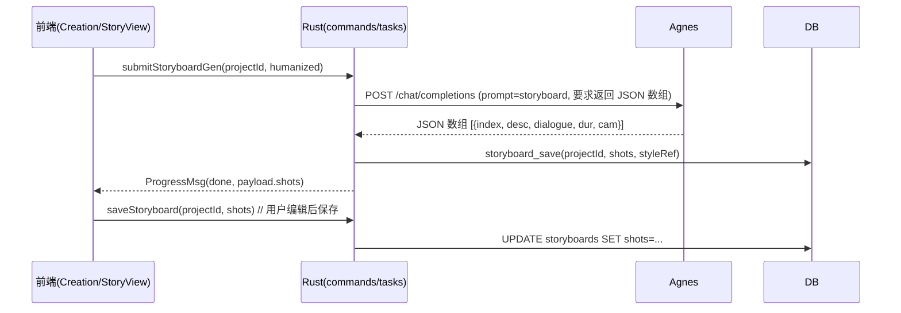
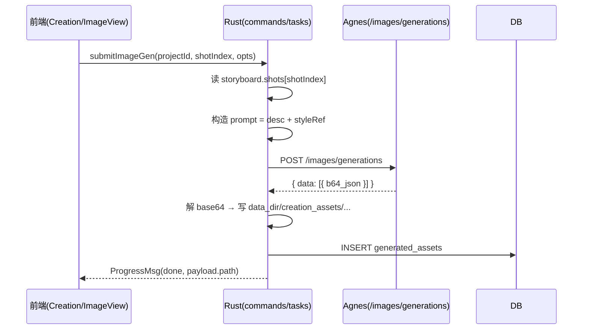
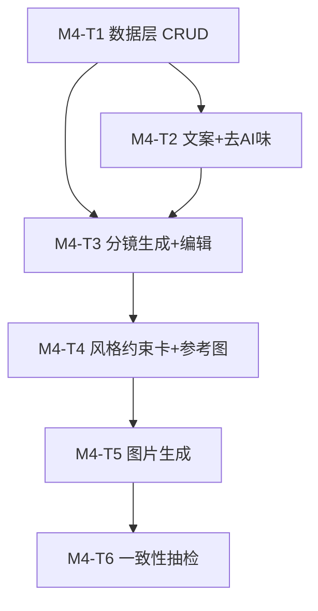

# M4 创作上（需求→分镜→图片）· 系统架构设计与任务分解

> 架构师：高见远（software-architect）｜主理人：齐活林（Qi）
> 配套基线：`docs/dev-plan.md` §M4 / `docs/technical-solution.md` §3.3·§6.5 / `docs/m2-film-design.md` / `docs/m3-spoken-design.md`
> 范围：需求 → 自动写文案 → 去 AI 味 → 分镜文案 → 分镜图片（保持一致）；M4 完成剩配音+字幕+首尾帧视频+导出（M5）

---

## 1. 实现方案 + 框架选型（沿用 M2/M3 既有栈，说明 M4 新增点）

### 1.1 技术栈（沿用，不引入新框架）
| 层 | 技术 | 说明 |
|----|------|------|
| 桌面外壳 | Tauri 2 + Rust 1.78+ | 沿用，新增创作命令/任务 |
| 前端 | React 18 + Vite + TS | 沿用 AppContext + ipc 三件套 |
| 持久层 | sqlx + SQLite | M0 已建 12 表，`creation_projects` / `storyboards` / `generated_assets` 已有 schema，补 CRUD |
| 编排/异步 | tokio + reqwest + Tauri Channel | 任务队列已就绪，新增创作任务类型 |
| AI 网关 | Rust reqwest 直连云端 | **M4 沿用 M3 模式**：LLM 走 Agnes `/chat/completions`（共用 `run_llm_json`），图像生成走 Agnes `/images/generations`（新增 `run_image_gen`） |
| 密钥 | keyring（系统凭据库） | 沿用 `cred.rs` |
| UI | Editorial Design System v3.0（自研 + Lucide） | 沿用，5 步 UI 已存在 |

### 1.2 M4 相对 M0–M3 的新增点

1. **Rust 数据层**：`db.rs` 补 `creation_projects` / `storyboards` / `generated_assets` 三表 CRUD。
2. **Rust 任务层**：`tasks.rs` 新增 4 个任务类型 `script_write` / `script_humanize` / `storyboard_gen` / `image_gen`，全部接 `ProgressMsg` 通道；新增 `run_image_gen`（Agnes 图像生成 + base64 → 本地文件 + 写 `generated_assets` 表）。
3. **Rust 命令层**：`commands.rs` 新增 `creation_project_*` / `storyboard_get` / `storyboard_save` / `image_save` / `script_write` / `script_humanize` / `storyboard_gen` / `image_gen`。
4. **AI 网关**：M4 不引入 Python sidecar，复用 M3 的 `run_llm_json`；新增 `run_image_gen` 走 Agnes `/images/generations`（OpenAI 兼容）。
5. **前端接线**：
   - `modules/Creation.tsx` 5 步 UI 重构：`sim()` 全部替换为真实 IPC。
   - `state/AppContext.tsx` 增加创作工程加载/选中 actions，删除 `sim()` 模拟实现。
   - `ipc/types.ts` 新增 `CreationProject` / `Storyboard` / `Shot` / `GeneratedAsset` / `ImageGenOptions`。
   - `ipc/client.ts` mock 同步新增 8 个命令 + 4 个任务类型模拟。
   - `ipc/providers.ts` 新增 `loadCreationProjects / createCreationProject / updateCreationProject / deleteCreationProject / loadStoryboard / saveStoryboard / submitScriptWrite / submitScriptHumanize / submitStoryboardGen / submitImageGen / loadGeneratedAssets` 等高层封装。
6. **关键算法**：一致性分镜图片生成（基于 styleRef + seed 族 + CLIP 相似度抽检）；风格约束卡（6 套，固化内置）；分镜文案 JSON schema（与 M3 `run_llm_json` 复用）。

### 1.3 关键算法落点决策（见 §8 论证）

- **自动写文案 / 去 AI 味 / 分镜生成**：全部走 `run_llm_json`（Agnes LLM），用 settings.prompts 中已有的 `script` / `humanize` / `storyboard` 提示词；失败时返回 mock 兜底数据，UI 提示"LLM 暂不可用"。
- **图片生成**：走 Agnes `/images/generations`，prompt 注入 styleRef（色调/字体/运镜）+ IP-Adapter 参考图（如果有）+ 固定 seed 族；返回 base64 → 写本地 `data_dir/creation_assets/{projectId}/` + 写 `generated_assets` 表。
- **一致性抽检**：图片生成后 Rust 端用 JPEG 体积/文件大小做粗筛（避免引入 CLIP 依赖）；UI 展示参考图列表 + 用户手动对比；详细 CLIP 留 M5/M6。
- **风格约束卡**：固化 6 套（现实/科幻/卡通/写实/动漫/水彩），与 M3 已有的 `stylePresets` 对齐；不允许用户自定义（M4 范围）。
- **分镜可编辑**：分镜步骤的画面/台词/时长/运镜均可在界面编辑（React state 已具备字段），保存走 `storyboard_save`；不破坏原 LLM 输出。

### 1.4 与 M2/M3 共享的关键不变量

- 时间单位统一秒（float）；分镜时长默认 4-6 秒/镜；IPC 信封 `Result<T, String>`；任务状态 `queued → running → done | failed`。
- 任何新增 IPC 命令必须在 `mockInvoke` 同步实现回退；任何新增任务类型必须在 mock 的 `task_submit` 分支模拟进度推送。
- API Key 走 `cred::get_key("llm" | "img")` 取系统凭据库，绝不落 SQLite 明文。

---

## 2. 文件列表及相对路径（标注【新增】/【修改】）

### 2.1 Rust（`src-tauri/src/`）
| 文件 | 状态 | M4 改动 |
|------|------|---------|
| `db.rs` | 【修改】 | 新增 `CreationProjectRow` / `StoryboardRow` / `GeneratedAssetRow` 类型 + 12 个 CRUD |
| `commands.rs` | 【修改】 | 新增 10 个命令 |
| `tasks.rs` | 【修改】 | `run_job` 新增 `script_write` / `script_humanize` / `storyboard_gen` / `image_gen` 4 个分支 + 对应 `run_*` 函数 + `run_image_gen` 工具（Agnes `/images/generations`） |
| `ffmpeg.rs` | 不变 | M4 不涉及媒体处理 |
| `python.rs` | 不变 | 已移除 |
| `cred.rs` | 不变 | 沿用 |
| `main.rs` | 不变 | — |

### 2.2 前端（`src/`）
| 文件 | 状态 | M4 改动 |
|------|------|---------|
| `modules/Creation.tsx` | 【修改】 | 5 步 UI 重构：ReqView 接真实 createCreationProject；ScriptView 接 submitScriptWrite；HumanView 接 submitScriptHumanize；StoryView 接 submitStoryboardGen + 分镜可编辑（已有 UI）+ saveStoryboard；ImageView 接 submitImageGen + 参考图上传（已有 UI） |
| `state/AppContext.tsx` | 【修改】 | 增 `loadCreationProjects / createCreation / updateCreation / deleteCreation / loadStoryboard / saveStoryboard / loadGeneratedAssets / submitScriptWrite / submitScriptHumanize / submitStoryboardGen / submitImageGen` 等 actions；删除原 `sim()` 实现；启动 effect 调 `loadCreationProjects()` |
| `data/mock.ts` | 【修改】 | `CreationState` 对齐 DB：`reqFromSpoken / brief / script / human / story / imgs / refs / voices / subs / styleRef / humanPrompt` 等字段；新增 `refCat` 映射 |
| `ipc/types.ts` | 【修改】 | 新增 `CreationProject` / `Storyboard` / `Shot` / `GeneratedAsset` / `ImageGenOptions` |
| `ipc/client.ts` | 【修改】 | `mockInvoke` 新增 10 个创作命令 + 4 个任务类型模拟 |
| `ipc/providers.ts` | 【修改】 | 新增 11 个高层封装 |

---

## 3. 数据结构和接口

### 3.1 数据库表 → 领域模型
```mermaid
erDiagram
    creation_projects {
        TEXT id PK
        TEXT brief          // 原始需求文本
        TEXT script         // 自动写文案
        TEXT humanized_script // 去 AI 味
        TEXT status         // draft|writing|humanized|storyboard|images|done
        INTEGER created_at
    }
    storyboards {
        TEXT id PK
        TEXT project_id FK
        TEXT shots          // JSON.stringify(Shot[])
        TEXT style_ref      // 风格约束卡 id（现实/科幻/卡通/写实/动漫/水彩）
    }
    generated_assets {
        TEXT id PK
        TEXT shot_id        // Shot 在 Storyboard 中的 index
        TEXT project_id FK
        TEXT kind           // image
        TEXT path           // 本地文件路径
        INTEGER created_at
    }
    creation_projects ||--o{ storyboards : project_id
    creation_projects ||--o{ generated_assets : project_id
```

### 3.2 领域类型
```typescript
interface CreationProject {
  id: string;
  brief: string;            // 原始需求
  script: string;            // 自动写文案
  humanizedScript: string;   // 去 AI 味
  status: string;            // draft|writing|humanized|storyboard|images|done
  createdAt: number;
}

interface Shot {
  index: number;
  desc: string;              // 画面描述
  dialogue: string;          // 台词
  dur: number;               // 时长（秒）
  cam: string;               // 运镜
}

interface Storyboard {
  id: string;
  projectId: string;
  shots: Shot[];
  styleRef: string;          // 风格约束卡 id
}

interface GeneratedAsset {
  id: string;
  shotId: number;            // Shot.index
  projectId: string;
  kind: 'image';
  path: string;
  createdAt: number;
}

interface ImageGenOptions {
  prompt: string;            // 注入 styleRef + shotDesc
  negativePrompt?: string;
  width: number;             // 1024
  height: number;            // 1024
  seed?: number;
  refImagePaths?: string[];  // IP-Adapter 参考图（可选）
  styleRef: string;          // 风格约束卡 id
}
```

### 3.3 image_gen 协议（Agnes `/images/generations`，OpenAI 兼容）
```jsonc
// 请求
{
  "model": "agnes-image-2.1-flash",
  "prompt": "<shotDesc> + <styleRef.tone> + <styleRef.font> + <styleRef.cam>",
  "negative_prompt": "...",
  "size": "1024x1024",
  "n": 1,
  "seed": 42
}
// 响应
{
  "data": [{ "b64_json": "..." }]    // base64 PNG
}
```
Rust 端 `run_image_gen`：
1. 取 `img` Provider 配置（base_url / model / api_key）
2. 构造 prompt：`<shotDesc>。色调：<styleRef.tone>。字体：<styleRef.font>。运镜：<styleRef.cam>`
3. POST `/images/generations` with Bearer
4. 解 base64 → 写 `data_dir/creation_assets/{projectId}/shot_{idx}_{ts}.png`
5. INSERT `generated_assets` 表，返回 path

### 3.4 智能粗剪 → 一致性抽检算法（确定性）
```text
对每个 Shot 生成图片：
  seed = base_seed + shot.index    // 固定 seed 族保一致性
  prompt = shot.desc + style_ref.tone + style_ref.font + style_ref.cam

生成后粗筛：
  file_size_kb = stat(path).size / 1024
  if file_size_kb < 5 || file_size_kb > 5000:
    emit warning「图片可能异常，请人工检查」

UI 端：
  - 横向并排展示 6 张分镜图 + 风格约束卡
  - 用户可点击重新生成（用同一 seed 不变；或点击 +10 seed 偏移）
```

---

## 4. 程序调用流程（Mermaid 时序图）

### 4.1 自动写文案 + 去 AI 味


### 4.2 分镜生成 + 编辑


### 4.3 图片生成


---

## 5. 任务列表（有序、含依赖、按实现顺序）

### M4-T1 · 数据层：creation_* CRUD
- **目标**：在 `db.rs` 落地 `creation_projects` / `storyboards` / `generated_assets` 三表 CRUD；`commands.rs` 暴露命令并 `lib.rs` 注册。
- **涉及文件**：`src-tauri/src/db.rs`【修改】、`src-tauri/src/commands.rs`【修改】、`src-tauri/src/lib.rs`【修改】、`src/ipc/client.ts`【修改】。
- **依赖**：M0（12 表已建）。
- **验收点**：经 `invoke` 真实读写 SQLite；mock 模式 localStorage 等价；`npm run build` 零错误。

### M4-T2 · 自动写文案 + 去 AI 味
- **目标**：`script_write` 任务走 Agnes LLM `script` 提示词；`script_humanize` 任务走 `humanize` 提示词；前端接真实 IPC。
- **涉及文件**：`src-tauri/src/commands.rs`、`src-tauri/src/tasks.rs`、`src/modules/Creation.tsx`、`src/state/AppContext.tsx`、`src/ipc/types.ts`、`src/ipc/providers.ts`、`src/ipc/client.ts`。
- **依赖**：T1。
- **验收点**：brief → script → human 链路跑通；LLM 失败降级；mock 模式可点验。

### M4-T3 · 分镜生成 + 编辑
- **目标**：`storyboard_gen` 任务走 Agnes LLM `storyboard` 提示词（要求返回严格 JSON 数组）；前端分镜可编辑（已有 UI）+ 保存走 `storyboard_save`。
- **涉及文件**：同 T2。
- **依赖**：T2。
- **验收点**：JSON 数组解析正确（解析失败时任务 failed）；分镜字段 5 个（desc/dialogue/dur/cam/index）齐全；编辑后保存可重新载入。

### M4-T4 · 风格约束卡 + 参考图分类
- **目标**：6 套风格预设（现实/科幻/卡通/写实/动漫/水彩）UI 选择 + 参考图按 IP形象/场景/产品/风格/材质/其他 分类（已有 M3 数据形态）。
- **涉及文件**：`src/modules/Creation.tsx`、`src/state/AppContext.tsx`。
- **依赖**：T3。
- **验收点**：风格切换实时显示对应色调/字体/运镜；参考图可上传 + 分类展示 + 删除。

### M4-T5 · 图片生成（Agnes /images/generations）
- **目标**：`image_gen` 任务：构造 prompt（desc + styleRef）→ POST Agnes → 解 base64 → 写本地文件 → INSERT `generated_assets`。
- **涉及文件**：`src-tauri/src/tasks.rs`（新增 `run_image_gen` 工具）、`src-tauri/src/commands.rs`、`src/modules/Creation.tsx`。
- **依赖**：T4。
- **验收点**：每镜生成图片成功；本地文件可读；`generated_assets` 表有记录；进度经 Channel 回传。

### M4-T6 · 一致性抽检（粗筛 + UI 展示）
- **目标**：图片生成后粗筛（文件大小阈值）+ UI 横向并排展示所有分镜图 + 风格约束卡。
- **涉及文件**：`src-tauri/src/tasks.rs`、`src/modules/Creation.tsx`。
- **依赖**：T5。
- **验收点**：异常图片有警告标签；UI 可重新生成（用 +10 seed 偏移）。

### 任务依赖图


---

## 6. 依赖包列表（沿用 M2/M3，零新增）

| 层 | 沿用 | M4 新增 |
|----|------|---------|
| Rust crate | tauri(2)、sqlx(0.8)、reqwest(0.12, rustls, json)、tokio(1)、serde/serde_json(1)、keyring(3)、uuid(1)、base64(0.22) | **无新增** |
| npm | react(18)、react-dom(18)、vite(5)、@tauri-apps/api(2)、@tauri-apps/plugin-dialog(2.7)、lucide-react(1.24)、typescript(5) | **无新增** |
| Python sidecar | — | **M4 不引入 sidecar**（沿用 M2 决策） |

---

## 7. 共享知识（跨文件约定）

1. **分镜 JSON schema**：`storyboards.shots = JSON.stringify(Shot[])`；Shot 字段：index/desc/dialogue/dur/cam。
2. **风格约束卡 schema**：`storyboards.style_ref` 存风格 id（现实/科幻/卡通/写实/动漫/水彩），由 `stylePresets` 提供 tone/font/cam 字段。
3. **一致性约束**：同一工程的所有分镜图使用 `base_seed + shot_index` 的固定 seed 族；prompt 注入 styleRef 全局共享。
4. **降级策略红线**：LLM 失败 → 返回 mock 兜底数据，UI 提示"LLM 暂不可用"；图片生成失败 → 任务 failed，返回可读错误。
5. **前端 mock 红线**：10 个创作命令 + 4 个任务类型必须在 `ipc/client.ts::mockInvoke` 同步实现；mock 数据形态与真实 DB 行严格对齐。
6. **图片存储**：`data_dir/creation_assets/{projectId}/shot_{idx}_{ts}.png`；`{ts}` 用 `SystemTime::now()` 秒级时间戳避免冲突。

---

## 8. 待明确事项（建议 + Boos 拍板项）

### Q1 · 图像生成 Provider 选型？
- **现状**：M2/M3 已绑定 Agnes（LLM/图/视频统一网关）；Agnes 图像生成走 `/images/generations`（OpenAI 兼容风格），模型 `agnes-image-2.1-flash`。
- **建议**：**沿用 Agnes 图像生成**（统一网关省配置；M2 已决策双网关仅 Agnes + XiaomiMimo）。
- **替代方案 A**：新增 SDXL + IP-Adapter 本地兜底（需 GPU + diffusers，体积大）。
- **替代方案 B**：增加通义万相作为图片 Provider（多网关复杂度上升）。
- **需 Boos 确认**：M4 沿用 Agnes，还是新增 Provider？

### Q2 · 风格约束卡粒度？
- **建议**：**固化 6 套**（现实/科幻/卡通/写实/动漫/水彩），与 M3 已有的 `stylePresets` 对齐；M4 不允许用户自定义。
- **替代方案 A**：4 套（去重写实 vs 现实）；减少选择成本但削弱风格差异。
- **替代方案 B**：用户可上传风格参考图（增加参考图维度，但复杂度翻倍）。
- **需 Boos 确认**：M4 是用 6 套（沿用）还是 4 套？

### Q3 · 一致性抽检深度？
- **建议**：**粗筛**（文件大小阈值 5KB-5MB）+ UI 横向对比；详细 CLIP 相似度抽检留 M5/M6 远期。
- **替代方案 A**：引入 image-hash 库做感知哈希（中等成本，可能引入 false positive）。
- **替代方案 B**：复用 Agnes 的图像理解接口做 caption，对比 caption 一致性（每次生成都多花一次 API 调用）。
- **需 Boos 确认**：M4 一致性抽检用粗筛 + UI 对比就够，还是要做 caption 比对？

### Q4 · 图片生成失败时降级策略？
- **建议**：**失败任务 failed + 返回可读错误**，UI 允许单镜重试；不阻塞其他分镜。
- **替代方案 A**：自动回退到 mock 图片（用户体验好但不真实）。
- **需 Boos 确认**：M4 是否接受单镜失败可重试的语义？

### 汇总待确认清单（回传主理人）
1. 图像生成 Provider 选型（沿用 Agnes / 新增 SDXL / 新增通义万相）
2. 风格约束卡粒度（6 套沿用 / 4 套精简 / 9 套新增）
3. 一致性抽检深度（粗筛 + UI 对比 / 加 image-hash / 加 Agnes caption 比对）
4. 图片生成失败降级（失败重试 / 自动回退 mock）

---

## 9. 已确认决策（Boos 拍板 · 2026-07-13）

主理人汇编后，Boos 对 §8 四项做出如下拍板，工程师按此实施：

| 项 | 决策 | 对实施的影响 |
|----|------|------|
| Q1 · 图像 Provider | **沿用 Agnes**（`/images/generations`，模型 `agnes-image-2.1-flash`） | T5 实现 `run_image_gen` 直接走 Agnes；不引入新依赖 |
| Q2 · 风格约束卡 | **6 套沿用**（现实/科幻/卡通/写实/动漫/水彩） | T4 复用 M3 `stylePresets`，无新增代码 |
| Q3 · 一致性抽检 | **粗筛（文件大小 5KB–5MB）+ UI 横向对比** | T6 仅做文件大小阈值检查 + UI 横向并排展示；零依赖 |
| Q4 · 图片失败降级 | **任务 failed + UI 允许单镜重试** | T5 不自动回退 mock，失败时返回可读错误，前端暴露重试按钮 |

> 结论：M4 按 **T1 → T6 全量实施**，按上述拍板方案落地；与 M3 共享 LLM 工具函数，不重复造轮子。

---

_编制：架构师 高见远 ｜ 对齐基线 14b8e34（M0–M2）+ M3 实施落地 ｜ 2026-07-13_